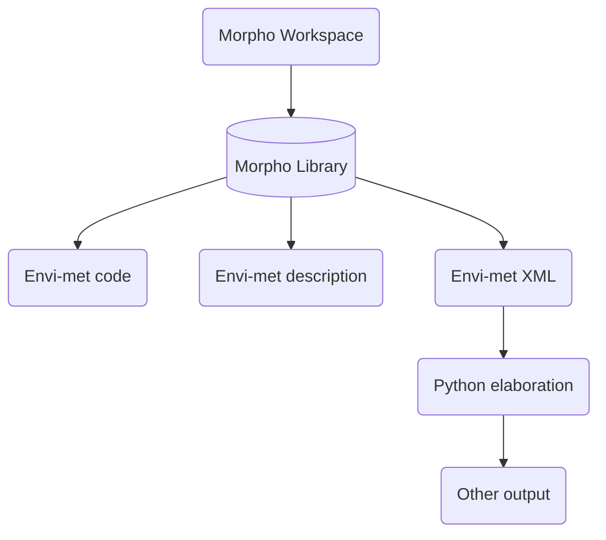

# Abstract

Il documento è delineato come una traccia metodologica pionieristica nel campo della modellazione ambientale, esplorando le nuove frontiere del progetto LIFE A_GreeNET con l'ausilio di ENVI-met. La ricerca è radicata nella necessità urgente di affrontare la crescente complessità e la scala delle sfide ambientali urbane, tracciando un percorso verso soluzioni sostenibili attraverso l'innovazione tecnologica e l'automazione.

Al centro di questo protocollo c'è l'aspirazione a trasformare non solo il modo in cui i modelli ambientali vengono costruiti e analizzati, ma anche come questi modelli possono influenzare il futuro delle politiche urbane e della pianificazione ambientale. Attraverso l'integrazione di Rhinoceros, Grasshopper e il plugin Morpho, si propone una sinergia tra precisione geometrica e una profonda comprensione ecologica, delineando città che non sono solo esteticamente piacevoli ma anche ecologicamente resilienti.

Il testo approfondisce in modo critico l'importanza della coerenza semantica e geometrica, non solo come parametro tecnico ma come fondamento per simulazioni che possono prevedere e mitigare gli impatti ambientali futuri. La dettagliata assegnazione dei materiali e la loro rappresentazione fedele si trasformano in strumenti capaci di prefigurare scenari urbani sostenibili, dove ogni componente ed edificio gioca un ruolo chiave nel bilancio energetico e nel confort urbano.

L'adozione di tecniche avanzate di automazione e scripting apre una nuova era nell'analisi ambientale. Il potenziale di Python, JavaScript e Obsidian non è solo di semplificare e velocizzare il processo di modellazione, ma di elevare il report a un nuovo livello di interattività e comprensione. Si prefigura un futuro in cui i report non sono semplici documenti statici, ma piattaforme dinamiche dove mappe interattive e grafici dettagliati permettono una comprensione istantanea e profonda delle dinamiche ambientali.

Non si trascura l'importanza cruciale della validazione e del controllo qualità. In un'epoca dove i dati sono onnipresenti, l'affidabilità e la precisione sono di fondamentale importanza. Il protocollo proposto non è solo una metodologia per generare dati, ma un impegno verso l'integrità scientifica e la riproducibilità dei risultati, assicurando che le decisioni basate su questi modelli siano fondate su basi solide e affidabili.

Questo documento non è semplicemente un manuale tecnico; è una visione per un futuro in cui la modellazione ambientale è al servizio di una progettazione urbana che è sostenibile, esteticamente appagante e profondamente radicata in un'etica di responsabilità ambientale. Le tecnologie e le strategie qui discusse non sono solo strumenti, ma i mattoni per costruire il futuro delle nostre città.

# Protocollo integrato per la modellazione ambientale automatizzata
Nel contesto del progetto LIFE A_GreeNET, la modellazione ambientale mediante l'uso di ENVI-met si confronta con la necessità di un numero considerevole di simulazioni, dovuta all'ampiezza delle aree in esame e alla complessità delle variabili coinvolte. Questa circostanza rende imprescindibile lo sviluppo di un protocollo di standardizzazione che possa rendere agile la creazione di una varietà di modelli. La realizzazione di tale protocollo trascende la semplice ricerca di efficienza, rivelandosi essenziale per assicurare una coerenza metodologica e l'affidabilità dei risultati ottenuti attraverso le diverse simulazioni.
In ambito di modellazione ambientale, il fattore tempo assume una rilevanza critica. I progetti richiedono infatti la rapida elaborazione e analisi di molteplici scenari per comprenderne gli impatti derivanti da varie tipologie di interventi ambientali. Questa urgenza sottolinea la necessità di disporre di un protocollo che, oltre a semplificare il processo di generazione dei modelli, ne garantisca l'integrità e l'accuratezza.
In questo contesto, il primo capitolo del protocollo si dedica all'istituzione di linee guida chiare e rigorose per la creazione e la gestione dei modelli ambientali in ENVI-met. Si mira a fornire agli utenti un insieme di strumenti e procedure che non solo velocizzino il processo di modellazione, ma che anche assicurino la coerenza e la replicabilità dei modelli su scala ampia. L'enfasi è posta sulla definizione di standard per la strutturazione dei dati, la denominazione dei layers e la coerenza geometrica, elementi tutti cruciali per la validità e l'efficacia dei modelli generati.
Saranno inoltre esplorate strategie per la gestione efficace dei workflow di modellazione, affrontando tematiche come l'ottimizzazione dell'uso delle risorse computazionali e l'integrazione di metodologie innovative per il trattamento dei dati. Il capitolo si propone, quindi, come una guida fondamentale per professionisti e ricercatori che operano nel campo della modellazione ambientale, fornendo loro le basi per costruire simulazioni accurate, efficienti e aderenti alle esigenze specifiche del progetto LIFE A_GreeNET.
## Ambiente di sviluppo e gestione dei modelli
Nel contesto della simulazione e modellazione ambientale, l'integrazione di software come Rhinoceros e Grasshopper, affiancata dall'uso del plugin Morpho, ideato da Antonello Di Nunzio, costituisce una metodologia avanzata e altamente efficiente. Questo insieme di strumenti permette di affrontare con precisione e flessibilità le complesse esigenze della modellazione ambientale.
Rhinoceros, comunemente noto come Rhino, è un software di modellazione tridimensionale utilizzato ampiamente in campi come il design industriale, l'architettura e l'ingegneria. La sua capacità di gestire geometrie complesse lo rende un candidato ideale per lo sviluppo di modelli dettagliati e precisi.

Grasshopper, un editor grafico integrato con Rhino, è progettato per semplificare la programmazione visuale, permettendo agli utenti di costruire algoritmi che manipolano geometrie per sviluppare modelli parametrici e forme elaborate. Questa sinergia facilita un approccio intuitivo alla modellazione, essenziale nella creazione di spazi complessi.

Nel 2020, Antonello Di Nunzio ha sviluppato il plugin Morpho, un'aggiunta significativa nel campo della modellazione ambientale. Utilizzando linguaggi come IronPython, Morpho è specificatamente progettato per la creazione di modelli ENVI-met in 2.5D e 3D. Estendendo le funzionalità di precedenti strumenti come lb_envimet e df_envimet, questo plugin funge da ponte tra Grasshopper e il software ENVI-met, ottimizzando così il flusso di lavoro di modellazione e analisi.

Morpho abilita gli utenti a configurare modelli 3D dettagliati in Grasshopper, manipolando elementi come materiali e vegetazione per riflettere accuratamente le dinamiche ambientali. Le sue capacità includono anche l'avvio e la gestione di simulazioni ENVI-met direttamente dall'interfaccia di Grasshopper, segnando un importante progresso nell'automazione dei processi di analisi ambientale. Tale integrazione consente una maggiore efficienza e precisione, poiché gli utenti possono adattare rapidamente i loro progetti in risposta a variabili ambientali e urbane.

L'interazione con plugin aggiuntivi come Ladybug permette un'analisi approfondita e una visualizzazione efficace dei dati, offrendo agli utenti una comprensione più profonda dell'impatto dei loro progetti sull'ambiente circostante.

L'unione di Rhinoceros, Grasshopper e Morpho rappresenta un avanguardia nell'ambito della modellazione ambientale, offrendo ai professionisti gli strumenti necessari per affrontare sfide complesse con maggiore flessibilità e precisione. Questa collaborazione sinergica tra strumenti avanzati apre nuove possibilità nella creazione di ambienti urbani responsabili e sostenibili, contribuendo significativamente alla qualità e all'efficacia delle soluzioni progettuali.

# Una piattaforme integrata per la modellazione ambientale dinamica
## Caratteristiche dei Modelli Standardizzati
Il protocollo proposto prevede l'impiego di modelli progettati secondo specifiche caratteristiche predefinite, che includono, ma non si limitano a:

- **Coerenza geometrica**: È imperativo che tutti i modelli mantengano una struttura geometrica uniforme per facilitare il confronto e l'integrazione dei dati attraverso le varie simulazioni. Questo implica un'attenzione particolare nella creazione di geometrie precise e nella loro corretta posizionamento all'interno del modello complessivo.

- **Coerenza semantica**: Ogni elemento del modello deve essere attentamente selezionato e configurato per riflettere accuratamente l'ambiente urbano o naturale oggetto di studio. Ciò comprende l'uso di materiali realistici per gli edifici, la rappresentazione fedele del terreno e delle piante, e l'inserimento accurato di receptor e sources. Questa coerenza semantica è fondamentale per assicurare che i modelli non solo appaiano realistici, ma si comportino in modo verosimile nelle simulazioni, fornendo così risultati validi e applicabili.

- **Coerenza nella denominazione dei layers**: Ogni layer all'interno del modello avrà un nome standardizzato che indica chiaramente il suo contenuto e funzione. Questa pratica non solo aiuta nel riconoscimento immediato, ma anche nell'elaborazione automatica dei dati e nell'analisi. La denominazione chiara e sistematica dei layers facilita la gestione e l'aggiornamento dei modelli, permettendo agli utenti di navigare e modificare i modelli con maggiore efficienza.

La combinazione di queste caratteristiche crea un framework robusto per la modellazione ambientale, che supporta non solo l'accuratezza tecnica, ma anche l'integrità concettuale dei modelli. L'adozione di questo protocollo di standardizzazione garantisce che i modelli siano non solo tecnicamente precisi, ma anche semanticamente pertinenti e facilmente gestibili, contribuendo significativamente all'efficacia complessiva delle simulazioni ambientali.
### Coerenza Geometrica degli elementi inseribili nei layers
Di seguito, le caratteristiche dettagliate degli elementi inseribili per ogni tipo di layer:

- **Edifici**: Gli edifici devono essere rappresentati come geometrie Mesh o Brep chiuse; le estrusioni leggere non sono ammissibili. È possibile che gli edifici siano parzialmente o interamente elevati dal terreno e posizionati sul piano zero o direttamente sul terreno, se presente. Quest'ultimo aspetto sarà gestibile attraverso un'opzione nell'interfaccia dedicata del software. #insert_image

- **Terreno**: Il terreno, qualora inserito, può consistere in una o più superfici Mesh o Brep. È fondamentale che eventuali discontinuità nel terreno nonpresentino pareti verticali perfette, in quanto ciò comprometterebbe la funzionalità del modello. Sarà implementata una verifica preliminare per assicurarsi che queste condizioni siano rispettate. Importante anche verificare che la superficie del terreno sia quanto più vicina al piano 0 e che non risulti mai più bassa di esso per non compromettere la validità del modello.

[[1.2.1 img1.afdesign]]

![[1.2.1 img1.jpg | Casi comuni di geometrie del terreno valide e non ]]
- **Materiali del Terreno**: Questi elementi possono essere rappresentati attraverso curve planari chiuse o superfici planari. Devono essere posizionati appena sopra il piano zero. Un vantaggio nell'utilizzo di superfici è la possibilità di creare zone vuote, o "fori", al loro interno, permettendo una maggiore flessibilità nella modellazione.

- **Piante 2D**: Analogamente ai Materiali del Terreno, le Piante 2D devono essere posizionate appena sopra il piano zero. #insert_image

- **Piante 3D, Receptor e Sources**: Questi elementi sono rappresentati tramite punti. Non è necessario che i punti siano posizionati direttamente sul terreno; è sufficiente una corretta collocazione sul piano xy per assicurare la loro efficacia nel modello.

- **Settings**: Questo layer non conterrà geometria.

Queste direttive forniscono una struttura chiara per la creazione di modelli in ENVI-met, assicurando così che ogni elemento contribuisca in modo ottimale alla simulazione complessiva.
#### Griglia e punto zero della griglia
Nel processo di integrazione tra ENVI-met e Rhinoceros, si adotta un approccio semplificato per la definizione del punto zero della griglia. Invece di assegnare un punto zero tradizionale (tipicamente situato nell'angolo inferiore sinistro della gabbia di controllo in ENVI-met), si stabilisce come riferimento il punto di coordinate *{0,0,0}*, corrispondente all'origine degli assi in Rhinoceros.
Questa scelta implica che tutte le geometrie debbano essere disegnate e posizionate nel quadrante superiore destro quando osservate in una vista dall'alto nel software Rhinoceros. Questa disposizione garantisce un allineamento coerente e intuitivo tra le coordinate del modello Rhinoceros e la griglia di simulazione di ENVI-met. #insert_image 
### Coerenza semantica
La creazione di modelli standard in ENVI-met richiede l'incorporazione di elementi essenziali che riflettano con precisione l'ambiente urbano e naturale oggetto di studio. Ogni componente del modello deve essere attentamente selezionato e configurato per assicurare che la realtà sia rappresentata fedelmente, garantendo così la validità e la pertinenza dei risultati delle simulazioni. I componenti chiave da includere nei template di modelli standard sono i seguenti:

- **Edifici con materiali conformi alla realtà o al progetto**: È fondamentale che gli edifici nei modelli siano rappresentati con materiali che rispecchino le proprietà termiche e fisiche reali. Questo include l'uso di materiali coerenti per muri e tetti, nonché la considerazione di elementi quali giardini verticali o tetti verdi, quando appropriato.

- **Materiali del terreno conformi alla realtà o al progetto**: La selezione dei materiali del terreno è cruciale per modellare adeguatamente l'interazione tra la superficie terrestre e l'atmosfera. Questi materiali devono essere scelti in base a conduttività termica, albedo e altre proprietà fisiche pertinenti. In situazioni in cui non è indispensabile, è possibile omettere questo aspetto e operare in "modalità Flat".

- **Elevazione del terreno**: La corretta rappresentazione dell'elevazione del terreno è essenziale per illustrare le variazioni topografiche che possono influenzare i microclimi locali. Questo aspetto assume particolare importanza in aree con notevoli variazioni di altitudine.

- **Piante 2D e 3D conformi alla realtà o al progetto**: La vegetazione deve essere rappresentata sia da piante semplici (erba e arbusti) che da piante 3D (alberi) per riflettere con accuratezza la distribuzione e l'impatto ambientale. Questo include la scelta di specie vegetali realistiche, con considerazione della loro densità, altezza, età e altre caratteristiche fisiche.

- **Uno o più receptor**: I modelli devono comprendere receptor per il monitoraggio e l'analisi di parametri ambientali in punti specifici. Questi receptor sono fondamentali per valutare l'impatto delle variazioni ambientali su persone, fauna e flora, e per eventuali ulteriori analisi.

- **Sources puntuali o distribuiti**: Nel modello è indispensabile includere fonti di inquinamento o di calore, come fontane o traffico veicolare. Queste possono essere rappresentate sia come sources puntuali sia come sources distribuite, a seconda della natura e distribuzione della fonte in questione.

Per ciascuno di questi elementi sarà creato un layer nel modello Rhinoceros, che indichi la tipologia e, ove necessario, specifichi un nome specifico per quella partizione del modello. Questa metodologia assicura una struttura organizzata e facilmente navigabile, essenziale per la gestione efficiente dei modelli e per la precisione delle simulazioni.

### Coerenza nella denominazione dei layers

| **Tipo**                  | **Nome Layer**                                                                           |
| ------------------------- | ---------------------------------------------------------------------------------------- |
| **Edifici**               | `building_{nomeGruppoEdifici}_{codiceMatV}_{codiceMatO}_{codiceMatVV}_{codiceMatVO}`     |
| **Terreno**               | `terrain`                                                                                |
| **Materiali del Terreno** | `terrainMat_{nomeMat}_{codiceMat}`                                                       |
| **Piante 2D**             | `simpleplant_{nomePlant}_{codicePlant2D}`                                                |
| **Piante 3D**             | `plant3d_{nomePlant}_{codicePlant3D}`                                                    |
| **Receptor**              | `receptor_{nomeReceptor}_{codiceReceptor}`                                               |
| **Sources**               | `source_{nomeSource}_{codiceSource}`                                                     |
| **Settings**              | `settings{xyDimension_{zDimension}_{Xelements}_{Yelements}_{Zelements}_{nestingValue}__` |

La tabella sopra presenta la nomenclatura standard per i layer all'interno dei modelli Rhinoceros utilizzati nelle simulazioni ENVI-met. Ogni nome di layer segue una struttura precisa per garantire coerenza e facilitare il riconoscimento dei diversi elementi.
- Per gli **Edifici**, il nome inizia con "building", seguito dal nome del gruppo di edifici e dai codici alfanumerici relativi ai materiali verticali, orizzontali e ai materiali di pareti e tetti verdi. Nel caso in cui un materiale verde non sia presente, si inserisce una "X" maiuscola al posto del codice.
- I layer **Terreno** e **Materiali del Terreno** sono identificati rispettivamente con "terrain" e "terrainMat", con l'aggiunta del nome del materiale e del suo codice alfanumerico per i materiali del terreno.
- Per le **Piante 2D e 3D**, i nomi dei layer iniziano con "simpleplant" e "plant3d", seguiti dal nome della pianta e dal suo codice identificativo. 
- I **Receptor** e le **Sources** sono identificati con "receptor" e "source", e includono il nome specifico e il codice alfanumerico associato.
Questa strutturazione assicura che ogni elemento del modello sia facilmente identificabile e catalogabile, contribuendo a una gestione efficiente del modello e a una maggiore precisione nelle simulazioni.
#### Esempio di denominazione dei layers

| Tipo | Nome Layer | Descrizione |
| ---- | ---- | ---- |
| **Edifici** | building_gruppo1_0200C1_0200R1_X_02AGSS | Edifici del gruppo 1 con pareti in Concrete Wall (heavy) (codice 0200C1), tetti in Roofing: Tile (codice 0200R1), e tetti verdi con substrato in green sandy loam (codice 02AGSS). 'X' indica l'assenza di pareti verdi. |
| **Terreno** | terrain | Rappresentazione del terreno senza specifiche aggiuntive. |
| **Materiali del Terreno** | terrainMat_asphalt_0200ST | Materiale del terreno in Asphalt Road (codice 0200ST). |
| **Piante 2D** | simpleplant_grass_0200XX | Piante 2D di tipo erba (Grass 25 cm average, dense) con codice 0200XX. |
| **Piante 3D** | plant3d_treeA_020440 | Piante 3D di tipo alberi (Q Oak - middle age) con codice 020440. |
| **Receptor** | receptor_sensorA_codiceRep | Receptor con nome sensorA. Il codice identificativo specifico non è fornito. |
| **Sources** | source_traffic_0200DR | Fonti di traffico veicolare (Test Lane) con codice 0200DR. |

Questa tabella illustra come i layer nel modello Rhinoceros vengono nominati secondo la nomenclatura standard per le simulazioni ENVI-met. Ogni layer è chiaramente identificato con un nome che rispecchia il tipo di elemento rappresentato e i codici specifici di ENVI-met che definiscono i materiali o gli elementi ambientali coinvolti. Ad esempio, nel caso degli edifici, i codici specificano i materiali delle pareti, del tetto e dei tetti verdi. Questa metodologia di nominazione consente una gestione accurata e sistematica dei vari componenti del modello, facilitando l'analisi e la simulazione di scenari ambientali complessi.
## Armonia algoritmica e strategie avanzate per organizzazione e visualizzazione in Grasshopper

Nell'era della modellazione ambientale avanzata e della progettazione algoritmica, l'efficienza e la chiarezza nei processi di gestione dei dati e di visualizzazione grafica sono diventate imprescindibili. Il presente capitolo intende esplorare e delineare metodologie sistematiche e ottimizzazioni grafiche all'interno del contesto di Grasshopper, uno strumento leader nel campo della progettazione parametrica e algoritmica. Attraverso l'analisi di convenzioni di denominazione e la gestione di file, insieme alle strategie di assegnazione cromatica e automatizzazione nei workflow, il capitolo mira a fornire un quadro esaustivo e metodico per facilitare processi di progettazione più organizzati, intuitivi e accessibili.

In questo ambito, la standardizzazione nella denominazione dei file e delle cartelle assume un ruolo cruciale. Tale standardizzazione non solo facilita l'archiviazione e il recupero dei dati, ma è essenziale anche per l'analisi accurata e l'interpretazione dei risultati delle simulazioni. Parallelamente, l'ottimizzazione grafica mediante l'utilizzo di palette cromatiche specifiche e l'automazione basata sui nomi dei gruppi in Grasshopper rappresenta un passo fondamentale verso l'incremento della leggibilità e dell'efficacia dei workflow, contribuendo significativamente alla riduzione della complessità visiva e al miglioramento dell'interazione utente-software.

Il paragrafo si propone, quindi, di fornire non solo una guida pratica alla gestione efficace dei file e alla visualizzazione ottimizzata in Grasshopper, ma anche di stimolare una riflessione più ampia sull'importanza di tali pratiche nel contesto della progettazione ambientale contemporanea. L'obiettivo è quello di delineare un approccio che possa essere sia pragmatico sia innovativo, offrendo agli utenti gli strumenti per navigare con sicurezza e competenza nell'ambiente sempre più complesso della modellazione e della progettazione algoritmica.
### Convenzioni di denominazione e gestione dei file

All'interno del processo di modellazione ambientale, la standardizzazione nella denominazione dei file e delle cartelle è un aspetto fondamentale che garantisce un'organizzazione efficace e una gestione efficiente dei dati.
#### File di Modello
Per ogni area di studio, saranno sviluppati due modelli distinti: uno che rappresenta lo stato attuale ("stato di fatto") e uno che rappresenta lo scenario futuro o di progetto. La denominazione di questi modelli seguirà una convenzione precisa, con l'uso di un nome distintivo per il progetto, seguito dalle lettere "A" per lo stato di fatto e "B" per lo scenario di progetto. Ad esempio, per un progetto denominato "GreenCity", i nomi dei file dei modelli potrebbero essere "GreenCity_A" per lo stato di fatto e "GreenCity_B" per lo scenario di progetto.
#### Cartelle di progetto Envi-met
Ogni modello genererà un progetto Envimet, con la creazione di cartelle dedicate per diversi orizzonti temporali: oggi, 2030 e 2050. Questo approccio permette di organizzare e confrontare efficacemente i dati e i risultati delle simulazioni per differenti scenari temporali. La struttura delle cartelle seguirà la logica del nome del progetto, con l'aggiunta dell'anno di riferimento. Per esempio, le cartelle per il progetto "GreenCity" saranno nominate come "GreenCity_A_nowday", "GreenCity_A_2030", "GreenCity_A_2050" per lo stato di fatto, e analogamente "GreenCity_B_nowday", "GreenCity_B_2030", "GreenCity_B_2050" per lo scenario di progetto.

Adottando queste convenzioni di denominazione, si facilita notevolmente il processo di archiviazione, ricerca e analisi dei file e dei dati di progetto, rendendo più agevole la gestione del flusso di lavoro e l'interpretazione dei risultati delle simulazioni.

| Categoria        | Convenzione di Denominazione         | Descrizione                                                                                                       |
|------------------|--------------------------------------|-------------------------------------------------------------------------------------------------------------------|
| File di Modello  | `{nomeProgetto}_A` e `{nomeProgetto}_B`        | Due modelli distinti per ogni area: "A" per lo stato di fatto e "B" per lo scenario di progetto.                  |
| Progetti Envimet | `{nomeProgetto}_A{anno}` e `{nomeProgetto}_B_{anno}` | Progetti Envimet creati per ogni modello, con cartelle separate per gli anni specifici: oggi (2023), 2030 e 2050. |

Questa tabella riassume le convenzioni di denominazione per i file di modello e i progetti Envi-met nel contesto della modellazione ambientale. La struttura chiara e sistematica facilita l'organizzazione e la gestione efficiente dei file di progetto.
### Organizzazione Visiva in Grasshopper

Prima di approfondire l'aspetto dell'assegnazione cromatica e funzionale dei gruppi nei workflow di Grasshopper, è essenziale comprendere il contesto e l'importanza di tale pratica nel panorama della progettazione algoritmica. Grasshopper, noto per la sua capacità di facilitare una progettazione parametrica e intuitiva, presenta sfide uniche in termini di organizzazione e interpretazione visiva dei dati. La necessità di un sistema efficace che permetta agli utenti di navigare, comprendere e manipolare complessi workflow algoritmici è cruciale. In questo contesto, emerge l'importanza di un approccio sistematico e visivamente intuitivo, che non solo aumenta l'efficienza operativa, ma migliora anche la chiarezza e la comprensione del processo di progettazione. L'assegnazione cromatica e la categorizzazione funzionale dei gruppi si inseriscono in questo scenario come strumenti fondamentali, consentendo agli utenti di Grasshopper di gestire con maggiore efficacia la complessità e la densità informativa tipiche dei loro ambienti di lavoro.
#### Assegnazione cromatica e funzionale dei gruppi nei workflow Grasshopper
Nell'ambito dei processi implementati mediante Grasshopper, si osserva un'approccio sistematico nell'identificazione delle varie componenti. Questo è realizzato attraverso l'assegnazione di gruppi distinti, ciascuno dei quali è caratterizzato da un colore specifico e una descrizione fornita tramite l'elemento "Scribble". Tale colore non è arbitrario, bensì funge da indicatore dell'appartenenza funzionale della componente all'interno del workflow complessivo. In questo contesto, si distinguono principalmente due categorie di gruppi: quelli che racchiudono funzioni operative specifiche e quelli che sono preposti alla facilitazione dell'interazione con l'interfaccia grafica utente (GUI). Questa metodologia di categorizzazione e identificazione visiva facilita una rapida comprensione del ruolo e della funzione di ciascun elemento all'interno del processo complessivo, contribuendo a un'efficace organizzazione e interpretazione del flusso di lavoro in Grasshopper.

```palette
https://coolors.co/palette/efc69b-df9c84-af1b3f-d04e6c
```

Proseguendo nella descrizione del sistema di assegnazione cromatica, si prevede l'impiego di una palette specifica, composta dai seguenti colori: efc69b, df9c84, af1b3f, e d04e6c. Questa selezione di colori non è casuale, ma segue una logica ben definita per ottimizzare la rappresentazione e la comprensione delle varie componenti del workflow.

I primi due colori della palette, efc69b e df9c84, sono dedicati esclusivamente agli elementi che rappresentano la logica del workflow. Questo include tutti quegli aspetti che concorrono a definire i comportamenti intrinseci del workflow, ovvero la struttura operativa e decisionale che ne governa il funzionamento. L'uso di questi due colori specifici per la logica del sistema mira a facilitare un'immediata identificazione visiva di questi componenti fondamentali.

Per quanto riguarda gli elementi associati all'interfaccia grafica utente (GUI), si è scelto di utilizzare gli altri due colori, af1b3f e d04e6c. L'impiego di questi colori per la GUI assicura una chiara distinzione rispetto agli elementi logici, permettendo agli utenti di riconoscere rapidamente le parti del workflow dedicate all'interazione con l'utente.

Inoltre, la scelta di utilizzare una doppia differenziazione cromatica all'interno di ciascuna delle due categorie principali (logica e GUI) non è solo una questione estetica, ma ha un significato più profondo. Questa differenziazione ha lo scopo di rappresentare una gradazione di importanza tra gli elementi molto simili tra loro. In questo modo, l'uso di sfumature diverse all'interno dello stesso ambito funzionale (logica o GUI) permette di indicare un'ulteriore stratificazione nell'importanza o nella gerarchia delle funzioni, contribuendo a una maggiore precisione nella comunicazione visiva del workflow. Questa scelta metodologica si inserisce quindi in un contesto di design informativo, mirato a massimizzare l'efficacia comunicativa del sistema di organizzazione visiva adottato in Grasshopper.

Segue una tabella dettagliata che elenca i colori selezionati per l'identificazione e la categorizzazione degli elementi nel workflow di Grasshopper. Per ciascun colore, è fornita la notazione esadecimale, la corrispondente composizione RGB (Red, Green, Blue), e un nome descrittivo che facilita la loro identificazione. Questi colori sono stati scelti per la loro capacità di rappresentare distintamente le diverse funzioni e importanze all'interno del workflow.

| Colore Esadecimale | Colore RGB      | Nome (Descrittivo) |
| ------------------ | --------------- | ------------------ |
| EFC69B          | (239, 198, 155) | PEACH              |
| DF9C84          | (223, 156, 132) | Atomic tangerine   |
| AF1B3F          | (175, 27, 63)   | Amaranth purple    |
| D04E6C          | (208, 78, 108)  | Cerise             |

La scelta di questi colori specifici è stata guidata dalla necessità di una chiara distinzione visiva tra i diversi componenti del workflow, nonché dall'intenzione di evocare una gerarchia visiva attraverso l'uso di diverse tonalità. La tabella qui presentata sarà un riferimento utile per comprendere il design e l'organizzazione del workflow in Grasshopper.

Al fine di ottimizzare l'efficienza del processo di organizzazione visiva nel workflow di Grasshopper, è stato implementato un meccanismo automatizzato per la colorazione dei gruppi basato sui loro nomi. Questo sistema utilizza specifiche stringhe identificative, quali ":logics" e ":gui", per determinare la funzione di ogni gruppo e assegnargli il colore appropriato dalla palette predefinita.

Quando un gruppo contenente una di queste stringhe viene identificato, il meccanismo attiva automaticamente l'algoritmo di colorazione, seguendo le regole stabilite. Ad esempio, se all'interno di un gruppo è presente un sotto-gruppo con la stringa ":logics", il sistema assegnerà a tale sotto-gruppo il secondo colore della coppia predefinita per gli elementi logici (in questo caso, df9c84 - Atomic Tangerine). Al gruppo contenitore, invece, verrà assegnato il primo colore della coppia (in questo caso, efc69b - Peach). Un analogo processo avviene per i gruppi e sotto-gruppi identificati con la stringa ":gui", ai quali vengono assegnati i colori d04e6c - Cerise e af1b3f - Amaranth Purple, rispettivamente.

Questo sistema di colorazione automatizzato non solo migliora l'efficienza del processo di organizzazione del workflow, ma contribuisce anche a una maggiore chiarezza visiva. Permettendo una rapida identificazione delle funzioni dei vari gruppi, facilita la comprensione e la navigazione all'interno di strutture workflow complesse. L'implementazione di questo sistema automatizzato rappresenta un significativo passo avanti nell'ottimizzazione dei processi di design e di gestione in Grasshopper, con implicazioni positive sia per la produttività che per l'accessibilità del software.

![[Chromatic and Functional Assignment of Groups in Grasshopper Workflows.png|Rappresentazione grafica dell'assegnazione cromatica e funzionale dei gruppi nei workflow Grasshopper. L'immagine mostra l'implementazione del sistema di colorazione basato sui nomi dei gruppi, evidenziando come i gruppi etichettati con ':logics' e ':gui' vengano automaticamente colorati secondo la palette predefinita. I colori specifici, Peach (efc69b) e Atomic Tangerine (df9c84), sono utilizzati per i gruppi di logica, mentre Amaranth Purple (af1b3f) e Cerise (d04e6c) sono assegnati ai gruppi relativi alla GUI. La visualizzazione chiarisce la differenziazione funzionale e la gerarchia all'interno del workflow, migliorando la leggibilità e l'organizzazione complessiva del progetto]]

Proseguendo nell'analisi del meccanismo di automatizzazione della colorazione, si evidenzia che l'algoritmo visuale illustrato in #figuradanumerare si avvale di componenti specifici del plugin Metahopper. Questi componenti sono strategicamente impiegati per selezionare i gruppi presenti all'interno del canvas di Grasshopper. Il sistema è programmato per riconoscere le stringhe chiave, come ':logics' e ':gui', nei nomi dei gruppi. Quando tali stringhe vengono identificate, l'algoritmo attiva il processo di colorazione, assegnando i colori come precedentemente descritto in base alla funzione specifica del gruppo.

È importante sottolineare che l'algoritmo tiene conto anche delle gerarchie interne tra i gruppi. In presenza di gruppi annidati, ovvero gruppi contenuti all'interno di altri gruppi, l'algoritmo applica una logica di colorazione differenziata. I gruppi interni, o sotto-gruppi, ricevono il secondo colore della coppia cromatica associata alla loro funzione principale, come precedentemente delineato. Questa distinzione cromatica non solo migliora l'organizzazione visiva del workflow, ma consente anche di percepire immediatamente la struttura gerarchica e le relazioni funzionali tra i vari componenti del progetto.

È rilevante sottolineare che l'impiego del processo di colorazione automatizzata tramite il plugin Metahopper è primariamente pensato per essere utilizzato nelle fasi di sviluppo e manutenzione dei processi in Grasshopper. Questo strumento si rivela particolarmente utile durante la realizzazione dei processi stessi e nella loro successiva manutenzione, fornendo una chiara visualizzazione delle diverse funzioni e una facilitata gestione delle componenti. Tuttavia, esso non è inteso per essere un requisito persistente nelle fasi finali di utilizzo del prodotto.

Nella fase di completamento e di rilascio del progetto, il sistema di colorazione e i componenti di Metahopper possono essere rimossi o disattivati. Ciò consente di presentare un prodotto finale più pulito e meno oneroso in termini di dipendenze da plugin aggiuntivi. In questo modo, si evita di imporre all'utente finale l'onere di dover gestire un ulteriore plugin come Metahopper. La flessibilità di questo approccio permette agli sviluppatori di beneficiare delle funzionalità avanzate durante le fasi di progettazione e manutenzione, senza però compromettere la semplicità e l'accessibilità del prodotto finale per l'utente.
#### Altre ottimizzazioni grafiche di automatizzazione
Nell'ambito dell'ottimizzazione grafica dei processi in Grasshopper, è stato sviluppato un ulteriore meccanismo automatizzato, mirato al miglioramento dell'organizzazione e della leggibilità visiva del canvas. Questo nuovo processo si concentra sull'analisi e la gestione degli oggetti "Panel" e "Slider" presenti nel workflow.

Per quanto riguarda gli oggetti "Panel", il sistema automaticamente identifica e seleziona questi elementi, verificando la presenza del nome standard "Panel". Nel caso in cui questo nome sia presente, il processo procede con la sua rimozione, assegnando contemporaneamente al "Panel" un colore distintivo, specificamente il tono F6E073, corrispondente in RGB a (246, 224, 115), e denominato "Jasmine". Questa colorazione specifica serve a rendere immediatamente riconoscibili questi oggetti, facilitando l'identificazione e la gestione dei dati visualizzati all'interno del canvas.


```palette
https://coolors.co/palette/F6E073
```

Segue una tabella che elenca e riassume i caratteri del colore utilizzato per i Panel.

| Colore Esadecimale | Colore RGB      | Nome (Descrittivo) |
| ------------------ | --------------- | ------------------ |
| F6E073           | (246, 224, 115) | Jasmine            |

In parallelo, il processo esegue una verifica simile sugli oggetti "Slider", focalizzandosi sui componenti con il nome standard "Number Slider". Qualora questi elementi siano rilevati, il nome standard viene rimosso, consentendo allo "Slider" di assumere automaticamente il nome dell'input a cui è connesso. Questa azione mira a migliorare la chiarezza funzionale dello "Slider", collegandolo più direttamente e intuitivamente alla sua specifica applicazione all'interno del workflow.

Come per le precedenti ottimizzazioni, anche questo processo è implementato attraverso l'uso del plugin Metahopper, confermando l'efficacia di questo strumento nel facilitare un'organizzazione visiva coerente e funzionale. Le considerazioni precedentemente espresse riguardo all'utilizzo di Metahopper durante le fasi di sviluppo e manutenzione, e alla sua eventuale rimozione nelle fasi finali di utilizzo del prodotto, rimangono valide anche per questo nuovo processo di automatizzazione.

![[Graphical components optimization 1.png|Visualizzazione del processo di ottimizzazione grafica in Grasshopper. L'immagine illustra l'implementazione del meccanismo automatizzato per la gestione degli oggetti 'Panel' e 'Slider'. Si osserva come gli oggetti 'Panel' vengono identificati e colorati nel tono 'Jasmine' (F6E073), per una maggiore distinzione visiva. Parallelamente, viene mostrata la rimozione del nome standard dai 'Number Slider']]

L'adozione di queste tecniche di ottimizzazione grafica mostrate in #figuradanumerare riflette un impegno costante nel migliorare l'efficienza e l'usabilità dei workflow in Grasshopper. Questi processi automatizzati non solo semplificano la gestione dei componenti all'interno del canvas, ma contribuiscono anche a rendere il processo di progettazione più intuitivo e accessibile, sia per gli sviluppatori che per gli utenti finali.

Alla luce delle considerazioni esposte nel corso di questo paragrafo, emerge con chiarezza la rilevanza di un approccio sistematico e ponderato nella gestione dei file e nell'ottimizzazione grafica dei processi in Grasshopper. La standardizzazione nella denominazione dei file e l'impiego di metodologie di assegnazione cromatica e automatizzazione non rappresentano semplici convenzioni operative, ma si rivelano strumenti essenziali per navigare efficacemente nell'ecosistema complesso della progettazione ambientale e algoritmica. #conclusioni

L'adozione di queste strategie non solo migliora la gestione e l'organizzazione dei dati, ma apporta anche un contributo significativo al miglioramento dell'interazione tra l'utente e il software. Questo approccio olistico, che combina la praticità operativa con un'attenta riflessione sulla presentazione e sull'usabilità dei dati, si configura come un passo fondamentale verso la creazione di ambienti di progettazione più intuitivi e accessibili.

Inoltre, l'implementazione di tali pratiche rispecchia e rafforza un'etica di lavoro che valorizza la chiarezza, la precisione e l'efficienza, qualità indispensabili nell'ambito della modellazione ambientale contemporanea. L'enfasi sulla leggibilità visiva e sull'organizzazione logica dei workflow non solo facilita la comprensione immediata dei processi complessi, ma promuove anche una maggiore trasparenza e replicabilità nelle metodologie di progettazione.

Infine, è importante sottolineare che, pur nella loro specificità tecnica, le strategie discusse in questo capitolo trascendono il mero ambito operativo, offrendo spunti di riflessione sulla natura stessa del processo di progettazione ambientale. L'integrazione di questi approcci metodologici e ottimizzazioni grafiche testimonia la crescente necessità di un pensiero progettuale che sia al contempo analitico e creativo, metodico e innovativo, in grado di rispondere efficacemente alle sfide poste dalla progettazione algoritmica e ambientale.

Nel quadro del progetto LIFE A_GreeNET, la modellazione ambientale, in particolare mediante l'uso di strumenti sofisticati quali ENVI-met, richiede un approccio metodologico rigoroso e accurato nella fase preparatoria dei modelli. Una componente fondamentale in questo processo è l'assegnazione metodica e precisa delle proprietà fisiche agli oggetti geometrici. Al fine di facilitare questa fase cruciale, rendendola più intuitiva e meno suscettibile a errori, viene proposta una soluzione innovativa: lo sviluppo di un'interfaccia grafica semplificata, specificatamente progettata per l'assegnazione di caratteristiche quali i materiali. Questo sottocapitolo si propone di esaminare approfonditamente la progettazione, le funzionalità essenziali e i vantaggi di questa interfaccia, delineando il suo potenziale contributo al processo di modellazione per il progetto LIFE A_GreeNET.
L'obiettivo primario di questa interfaccia grafica è quello di rendere il processo di assegnazione delle proprietà agli oggetti geometrici non solo più agevole, ma anche più efficiente. Il focus principale è posto sull'assegnazione dei materiali, una fase determinante per l'accuratezza e la validità dei modelli in ENVI-met. La progettazione di questa interfaccia si concentra sulla sua intuitività e accessibilità, con l'obiettivo di diminuire in modo significativo sia la complessità tecnica che il tempo impiegato nella preparazione dei modelli.
Una caratteristica chiave dell'interfaccia è la sua capacità di interpretare e assegnare i materiali dalla libreria standard di ENVI-met. Questa funzionalità è di fondamentale importanza, in quanto permette agli utenti di selezionare con facilità e precisione i materiali adatti per ciascun oggetto geometrico, assicurando che le proprietà fisiche e termiche siano correttamente rappresentate nel modello finale, incrementando così l'accuratezza e l'affidabilità delle simulazioni.
Un elemento cruciale di questa interfaccia è la guida fornita all'utente e il feedback visivo offerto. La GUI (Graphical User Interface) è stata progettata per fornire istruzioni chiare e feedback immediato, guidando l'utente passo dopo passo nel processo di assegnazione dei materiali. Tale approccio rende l'interfaccia estremamente facile da utilizzare, riducendo al minimo la possibilità di errori e rendendo il processo il più diretto e semplice possibile.
Infine, è stata posta particolare attenzione alla personalizzazione e flessibilità dell'interfaccia. Nonostante l'uso della libreria standard di ENVI-met, è stato previsto un margine di flessibilità per permettere la personalizzazione e l'inserimento di nuovi materiali. Questa caratteristica è essenziale per consentire agli utenti di modellare una vasta gamma di scenari ambientali diversificati, estendendo così significativamente le possibilità di modellazione e simulazione all'interno del progetto.
È importante sottolineare che questa interfaccia non genererà direttamente un file INX (modello ENVI-met), ma utilizzerà le regole definite nel protocollo per costruire un modello Rhinoceros conforme. Questo approccio garantisce che il modello risultante sia non solo tecnicamente accurato, ma anche pienamente allineato con le specifiche e le aspettative del progetto, contribuendo in modo significativo alla standardizzazione e all'efficienza del processo di modellazione ambientale.
## Descrizione dell'interfaccia grafica e del suo sviuluppo
Nella fase di concezione di un'interfaccia grafica efficace e funzionale per il nostro progetto in Grasshopper, si è optato per un approccio metodologico che prende avvio dalla creazione di un mockup mediante il software Figma. Questa fase iniziale si rivela fondamentale per garantire che l'interfaccia non solo risulti esteticamente gradevole, ma si dimostri anche intuitiva e rispondente alle esigenze specifiche degli utenti. Utilizzando Figma, uno strumento avanzato per il design UI/UX, si ha la possibilità di esplorare varie opzioni di layout, palette cromatiche e percorsi utente in modo rapido ed efficiente, consentendo una rappresentazione chiara e dettagliata del design prospettato prima del suo effettivo sviluppo.

8 . Dunque, l'adozione di un approccio basato su mockup in Figma ha permesso non soltanto di visualizzare l'estetica dell'interfaccia, ma anche di analizzare in modo approfondito il flusso di lav oro e le interazioni degli utenti con il software. Questo processo ha contribuito significativamente a una progettazione dell'interfaccia che sia non solo funzionale ed efficiente, ma anche altamente adattata alle esigenze e alle aspettative degli utenti finali.

Per fornire una visione più tangibile del processo di sviluppo dell'interfaccia grafica, è disponibile un prototipo interattivo creato in Figma, accessibile al seguente link: [Visualizza il Prototipo Figma](https://www.figma.com/proto/piXHfKr0uQ1vxgWgOLK747/Envi-met-protocol-interface?type=design&node-id=2066-44&t=qyX0R37RC5tYsMwz-1&scaling=min-zoom&page-id=0%3A1&mode=design). Questo prototipo offre una rappresentazione pratica delle decisioni di design e della struttura dell'interfaccia, consentendo agli utenti di interagire direttamente con il layout proposto, i colori, e gli elementi di navigazione. L'accesso al mockup permette una comprensione immediata delle dinamiche e delle funzionalità dell'interfaccia, oltre a fornire un esempio concreto di come le teorie e i concetti discussi nel testo si traducano in applicazioni pratiche. Si invita il lettore a esplorare il prototipo per apprezzare pienamente l'efficacia e l'intuitività dell'interfaccia sviluppata. 
## Sviluppo dello strumento per la creazione dei modelli inx #daRivedere 
Nell'ambito di studi avanzati di modellazione ambientale e progettazione algoritmica, questa sezione presenta un'analisi approfondita delle metodologie e degli strumenti utilizzati per attribuire parametri fondamentali ai componenti ambientali attraverso l'interfaccia di Grasshopper e Envi-met. Oltre a stabilire le proprietà geometriche e fisiche degli elementi in esame, questo capitolo pone le basi per simulazioni ambientali complesse

La discussione si apre mettendo in evidenza la libreria 'Morpho' di Grasshopper, sottolineando l'essenziale interoperabilità tra gli strumenti di modellazione e progettazione algoritmica. Verranno illustrati il processo di selezione e l'applicazione di materiali e elementi vegetativi nelle simulazioni, promuovendo un approccio che incoraggia l'esplorazione e la personalizzazione, aspetti cruciali per una progettazione ambientale di livello avanzato.

Approfondendo, il testo si immerge nella descrizione delle tecniche di assegnazione del terreno, esaminando metodi e strumenti per definire le sue caratteristiche geometriche e materiche. Questo esame si estende agli edifici e ai loro materiali, esplorando le reciproche influenze con l'ambiente circostante. Un'attenzione particolare è rivolta alla possibilità di sopraelevazione degli edifici e alle sue implicazioni, riflettendo sulla complessità e sull'interconnessione dei vari fattori urbani.

Contemporaneamente, la trattazione si estende all'integrazione di elementi vegetativi, sia bidimensionali che tridimensionali, nel modello. Saranno delineati il processo di selezione e il posizionamento di queste entità cruciali, discutendo la loro rappresentazione accurata e il significato che assumono nel contesto di ecosistemi urbani e naturali.

La disposizione dei receptor, individuali o in griglia, viene quindi esaminata, mettendo in luce come la loro collocazione sia fondamentale per la raccolta di dati ambientali specifici e per l'analisi di scenari complessi. Segue un'esposizione sulle tecniche di ottimizzazione della simulazione, tra cui il nesting e la geolocalizzazione dei modelli, enfatizzando l'importanza della precisione e dell'efficienza nella modellazione ambientale.

Infine, il capitolo si conclude con una riflessione sulla pre-visualizzazione colorata in base ai materiali indicati delle geometrie, un aspetto che semplifica l'interpretazione visiva e l'ajustement del modello, sottolineando l'importanza di una rappresentazione intuitiva e coerente nel flusso di lavoro di Grasshopper. Questa panoramica fornisce una solida base per la comprensione e l'implementazione di strategie efficaci nella modellazione ambientale e nella progettazione algoritmica. 

### Esplorazione della libreria Envi-met
In questa sezione si articola il processo di indagine e applicazione della libreria Envi-met all'interno dell'ambiente di Grasshopper. Verrà esaminato come si possono navigare e utilizzare efficacemente le risorse della libreria per tradurre gli oggetti creati in Rhino in componenti operativi all'interno di un modello Envi-met. L'accento sarà posto sull'importanza critica dell'interoperabilità tra i software per facilitare una transizione fluida e funzionale.

Il processo di lettura della libreria Envi-met è reso notevolmente più comprensibile attraverso l'uso dello schema fornito di seguito. Questa rappresentazione visiva fornisce una panoramica chiara e organizzata del flusso di lavoro, delineando in modo intuitivo le relazioni e le connessioni tra le varie fasi e componenti ed è possibile apprezzare rapidamente la sequenza logica delle operazioni che verranno descritte.



L'adozione del componente 'Morpho Library' in Grasshopper segna un significativo avanzamento nell'interoperabilità tra strumenti di modellazione ambientale e di progettazione algoritmica. Questo approccio non solo semplifica il processo di selezione e applicazione dei materiali e degli elementi vegetativi nelle simulazioni, ma promuove anche una maggiore sperimentazione e personalizzazione, elementi fondamentali per una progettazione ambientale avanzata e innovativa.

Come illustrato nell'immagine #figuradanumerare , l'uso del componente 'Morpho Library' ha permesso l'estrazione efficace di elementi chiave dalla libreria di Envi-met. Specificamente, sono stati selezionati e isolati i seguenti componenti: 'Wall', 'Greening', 'Profile', 'Plant', 'Plant3D', e 'Sources'. Per ciascuno di questi, è stato creato un ramo distinto all'interno del processo di Grasshopper, consentendo una gestione organizzata e mirata che restituisce informazioni indistintamente dalla libreria standard e dalla libreria personale dell'utente (previa modifica attraverso gli appositi strumenti messi a disposizione da Envi-met).

Nel quadro dell'integrazione avanzata tra Grasshopper e Envi-met, rivestono un ruolo cruciale i componenti 'Morpho Library' e 'Morpho Workspace'. Il primo funge da ponte diretto verso la vasta libreria di Envi-met, permettendo agli utenti di estrarre e manipolare specifici elementi ambientali e materiali per i loro progetti.

In parallelo, 'Morpho Workspace' gioca un ruolo strategico nel definire la posizione della cartella di workspace di Envi-met e specificare il nome del progetto Envi-met attivo. Essenziale per contenere tutte le informazioni e i dati configurati per uno specifico progetto ambientale, il workspace di Envi-met include simulazioni, materiali, configurazioni vegetative e altro. 'Morpho Workspace' non solo indica il percorso fisico dei dati, ma serve anche come riferimento contestuale per l'intero progetto, assicurando che tutte le operazioni in Grasshopper siano allineate con il progetto Envi-met specifico. Questa sincronizzazione garantisce che le modifiche, le selezioni e le analisi siano sempre pertinenti e aggiornate.
![[readLibrary.png]]
Inserendo la parola chiave 'wall' nell'input `_type_` di 'Morpho Library', si possono ottenere immediatamente i codici Envi-met e le descrizioni di ogni costruzione muraria presente nella libreria. Questo consente una selezione e un'esplorazione rapide delle varie opzioni di costruzione muraria disponibili, fondamentali per la modellazione di ambienti urbani e naturali.

Per una disamina più approfondita, in particolare per ottenere dettagli sui 'Materials' (ovvero i codici dei materiali che compongono la costruzione) e il 'Color', si utilizza il componente 'morpho_decompose_xml'. Questo componente analizza il codice XML fornito in output da 'Morpho Library', estraendo le informazioni pertinenti attraverso le opportune parole chiave. La capacità di decomporre e interpretare questi dati è cruciale per comprendere e utilizzare efficacemente le risorse della libreria Envi-met.

Nella libreria Envi-met, i colori sono indicati in formato decimale. Per interpretarli correttamente in Grasshopper, è necessaria una conversione in formato RGB. A tal fine, è stato implementato uno script Python specifico che esegue la conversione dei colori dal formato decimale a quello esadecimale, garantendo che ogni colore sia rappresentato correttamente mediante sei cifre. Questo script suddivide il codice esadecimale in tre componenti RGB (rosso, verde e blu), permettendo una rappresentazione accurata e visiva dei colori all'interno di Grasshopper:

```python
`hex_color = format(decimal_color, '06x')  # Converte in esadecimale con padding per assicurarsi di avere 6 cifre  
# Suddivide l'esadecimale in tre componenti RGB
red = int(hex_color[0:2], 16)
green = int(hex_color[2:4], 16)
blue = int(hex_color[4:6], 16)`
```
![[decimalToRGB.png]]
L'output di questo script viene poi convertito in un parametro 'Color' dal componente 'Colour RGB', come mostrato nell'immagine #figuradanumerare . Questo processo non solo assicura che i colori siano interpretati correttamente, ma consente anche una visualizzazione intuitiva e coerente all'interno del workflow di Grasshopper.

Gli output del ramo 'Wall' in Grasshopper sono specificamente delineati per fornire una comprensione completa delle caratteristiche di ogni costruzione muraria. Gli output includono:

- ***'wall_code'***: lista di codici identificativi univoci di ogni costruzione muraria all'interno della libreria Envi-met.
- ***'wall_layer_code'***: I codici dei materiali che compongono ogni costruzione.
- ***'wall_description'***: Una descrizione testuale che fornisce ulteriori dettagli sulle costruzioni murarie, facilitando la selezione basata sul contesto del progetto.
- ***'wall_colour'***: La rappresentazione del colore della costruzione muraria in Grasshopper, convertita in formato RGB, per una visualizzazione accurata e intuitiva.

Proseguendo nell'analisi dei rami di questo processo Grasshopper, il ramo 'Greening' merita una particolare attenzione. Questo ramo è dedicato all'esplorazione e alla gestione delle opzioni relative a tetti verdi e pareti verdi, componenti vitali per la progettazione di spazi urbani sostenibili e la mitigazione del microclima. Inserendo la parola 'greening' nell'input type di 'Morpho Library', si attiva la selezione di questi elementi specifici dalla libreria di Envi-met.

Il focus primario in questo ramo è la lettura e l'interpretazione del 'Color' dall'XML prodotto da 'Morpho Library'. Questo passaggio è cruciale poiché il colore rappresenta non solo un aspetto estetico, ma può anche indicare varie caratteristiche ambientali e funzionali delle soluzioni di greening. La conversione del colore da formato decimale a RGB avviene attraverso un processo simile a quello utilizzato per il ramo 'Wall', garantendo una rappresentazione accurata e intuitiva all'interno di Grasshopper.

Gli output finali del ramo 'Greening' forniscono un insieme di dati chiave che permettono di comprendere e utilizzare le varie opzioni di greening disponibili. Questi includono:

***'greening_code'***: una lista di codici identificativi univoci per ciascuna soluzione di greening presente nella libreria Envi-met.
***'greening_description'***: una descrizione testuale che fornisce dettagli approfonditi sulle caratteristiche e le applicazioni di ogni soluzione di greening.
***'greening_colour'***: la rappresentazione del colore delle soluzioni di greening in Grasshopper, convertita in formato RGB per una visualizzazione precisa e significativa.

Procedendo con l'analisi, il ramo 'Profile' assume un ruolo fondamentale, concentrando la sua attenzione sulla stratigrafia dei materiali del terreno. Questo aspetto è cruciale per comprendere e modellare l'interazione del terreno con le variabili ambientali e climatiche. Digitando la parola 'profile' nell'input `_type_` di 'Morpho Library', si attiva la selezione di questi specifici elementi dalla libreria di Envi-met.

L'analisi nel ramo 'Profile' si focalizza sulla lettura di 'Emissivity', 'Albedo', e 'Color' dall'XML fornito da 'Morpho Library'. Questi dati sono essenziali per valutare le proprietà riflettive e radiative del terreno. 'Emissivity' estrae i valori di emissività, che indicano la capacità del terreno di emettere radiazioni infrarosse, mentre 'Albedo' riguarda i valori relativi alla riflettività del terreno, ovvero quanto efficacemente il terreno riflette la luce solare. Questi parametri influenzano significativamente il bilancio termico e il microclima di un'area. Analogamente al processo descritto nei rami precedenti, il colore viene convertito da formato decimale a RGB per garantire una rappresentazione visiva accurata e intuitiva in Grasshopper.

Gli output finali del ramo 'Profile' sono progettati per fornire una panoramica completa e dettagliata delle caratteristiche fisiche e ottiche dei materiali del terreno. Questi includono:

- ***'profile_code'***: un elenco di codici univoci per ciascun profilo di terreno presente nella libreria Envi-met, permettendo un facile riferimento e selezione.
- ***'profile_emissivity'***: i valori di emissività associati a ciascun profilo di terreno, fondamentali per analisi termiche e studi di comfort ambientale.
- ***'profile_description'***: una descrizione testuale che offre informazioni dettagliate sulla composizione e sulle proprietà di ciascun profilo di terreno.
- ***'profile_colour'***: la rappresentazione visiva del colore del terreno in Grasshopper, convertita in formato RGB per una visualizzazione precisa.
- ***'profile_albedo'***: i valori di albedo per ciascun profilo, essenziali per valutare la riflettività e l'impatto del terreno sul microclima circostante.

Proseguendo l'approfondimento, il ramo 'Plant' si rivela essenziale per la gestione e l'analisi di piccole piante e arbusti, elementi critici per la modellazione di ecosistemi e spazi verdi in contesti urbani e naturali. Inserendo la parola 'plant' nell'input `_type_` di 'Morpho Library', si attivano la selezione di questi specifici elementi dalla libreria di Envi-met, avviando un processo focalizzato sull'acquisizione e l'analisi dettagliata delle caratteristiche vegetative.

In questo ramo, l'attenzione è rivolta alla lettura di 'Height', 'Albedo', e 'Color' dall'XML fornito da 'Morpho Library'. 'Height' estrae i valori di altezza delle piante, fornendo dati cruciali per comprendere la scala e l'impatto visivo delle specie vegetative all'interno del progetto. Parallelamente, 'Albedo' riferisce i valori relativi alla capacità delle piante di riflettere la luce solare, un parametro significativo per studi di bilancio termico e comfort ambientale. Come nei rami precedenti, il colore viene convertito da formato decimale a RGB, assicurando una rappresentazione visiva fedele e intuitiva delle piante all'interno di Grasshopper.

Gli output finali del ramo 'Plant' sono progettati per offrire una panoramica esauriente e utilizzabile delle caratteristiche delle piante selezionate. Questi output includono:

- ***'plant_code'***: un elenco di codici identificativi univoci per ciascuna pianta o arbusto presente nella libreria Envi-met, permettendo un riferimento diretto e una facile selezione.
- ***'plant_description'***: una descrizione testuale che offre informazioni dettagliate sulla morfologia, le caratteristiche e le applicazioni potenziali di ciascuna specie vegetativa.
- ***'plant_height'***: i valori di altezza per ciascuna pianta, essenziali per la valutazione dell'***impatto visivo e ambientale.
- ***'plant_colour'***: la rappresentazione del colore delle piante in Grasshopper, convertita in formato RGB per una visualizzazione precisa e significativa.
- ***'plant_albedo'***: i valori di albedo per ciascuna pianta, cruciali per analizzare e comprendere l'interazione tra vegetazione e radiazione solare.

Il ramo 'Plant3D' rappresenta un elemento fondamentale all'interno del processo di Grasshopper, focalizzato sulla gestione e l'analisi di piante e arbusti tridimensionali, offrendo un approccio avanzato alla modellazione e all'analisi degli elementi vegetativi all'interno dell'ambiente. Inserendo la parola 'plant3d' nell'input `_type_` di 'Morpho Library', gli utenti attivano la selezione di queste specifiche piante e arbusti dalla libreria di Envi-met, avviando un processo mirato all'acquisizione e all'analisi dettagliata delle loro caratteristiche.

All'interno di questo ramo, vengono letti diversi attributi chiave da un file XML, tra cui 'AlternativeName', 'Height', 'Width', 'PipeFactor', 'Albedo', e 'Color'. Questi attributi forniscono una panoramica completa e dettagliata delle piante e degli arbusti tridimensionali, offrendo agli utenti un'approfondita comprensione delle caratteristiche fisiche e ottiche di ciascuna specie vegetativa. L'attributo 'AlternativeName' fornisce il nome latino della pianta, quando disponibile, fornendo una denominazione precisa per identificare in modo inequivocabile ciascuna specie vegetativa. La lettura dei valori di 'Height' estrae le informazioni sull'altezza delle piante tridimensionali, consentendo agli utenti di valutare la scala e l'impatto visivo di ciascuna specie all'interno del contesto ambientale. 'Width' indica la larghezza delle piante, un parametro significativo per comprendere la distribuzione volumetrica delle specie vegetative, contribuendo alla rappresentazione accurata della loro struttura. Il parametro 'PipeFactor' rappresenta un fattore relativo allo spessore del tronco o della struttura principale delle piante, fornendo informazioni cruciali per la definizione tridimensionale delle piante. L'attributo 'Albedo' estrae i valori di albedo, fondamentali per l'analisi della riflettività delle superfici vegetali e il loro impatto sul bilancio termico dell'ambiente circostante. Inoltre, l'acquisizione dei colori in formato decimale e la successiva conversione in formato RGB per l'attributo 'Color' garantiscono una visualizzazione precisa e intuitiva delle piante tridimensionali all'interno del processo di Grasshopper.

Un aspetto particolarmente rilevante di questo ramo è l'estrazione dei punti 3D che costituiscono la struttura dell'albero. Questi punti sono fondamentali per la rappresentazione tridimensionale delle piante. L'estrazione avviene attraverso uno script Python specifico contenuto nel componente rinominato 'Envi-met tree points gen', che analizza il file XML e crea una lista di punti 3D corrispondenti alla struttura dell'albero.


```python
import Rhino.Geometry as rg

def process_input_string(input_string):
    # Divide la stringa in linee
    lines = input_string.split('\n')

    # Crea una lista vuota per i punti
    points = []

    # Itera su tutte le righe eccetto la prima e l'ultima
    for line in lines[1:-1]:
        # Divide la riga in base alle virgole e converte in numeri float
        parts = line.strip().split(',')
        if len(parts) >= 3:
            try:
                # Crea un punto 3D da i primi tre valori
                x, y, z = float(parts[0]), float(parts[1]), float(parts[2])
                point = rg.Point3d(x, y, z)
                points.append(point)
            except ValueError:
                # Salta la riga se la conversione fallisce
                continue

    return points

points_3d = process_input_string(input_string)
```


L'output finale del ramo 'Plant3D' offre una visione completa e dettagliata delle piante e degli arbusti tridimensionali disponibili nella libreria di Envi-met. Gli attributi e i dati estratti forniscono una base solida per la modellazione avanzata e l'analisi dettagliata degli elementi vegetativi. Gli output includono:

- ***'plant3D_code'***: un elenco di codici identificativi univoci per ciascuna pianta o arbusto tridimensionale, consentendo un riferimento diretto e una facile selezione.
- ***'plant3D_alternative_name'***: il nome latino della pianta, quando disponibile, per una denominazione precisa.
- ***'plant3D_description'***: una descrizione testuale che offre informazioni dettagliate sulla morfologia, le caratteristiche e le applicazioni potenziali di ciascuna specie vegetativa tridimensionale.
- ***'plant3D_base'***: rappresenta la base della pianta tridimensionale, fornendo un punto di riferimento chiave per la modellazione e l'analisi.
- ***'plant3D_points'***: una lista di punti 3D che costituiscono la struttura dell'albero o della pianta tridimensionale, fondamentale per la rappresentazione volumetrica.
- ***'plant3D_colour'***: la rappresentazione del colore delle piante tridimensionali in formato RGB, garantendo una visualizzazione precisa e significativa.
- ***'plant3D_height'***: i valori di altezza per ciascuna pianta tridimensionale, essenziali per la valutazione dell'impatto visivo e ambientale.
- ***'plant3D_width'***: indica la larghezza delle piante tridimensionali, permettendo di valutare la distribuzione volumetrica.
- ***'plant3D_albedo'***: i valori di albedo per ciascuna specie vegetativa tridimensionale, utili per l'analisi della riflettività e del bilancio termico.
- ***'plant3D_pipefactor'***: il fattore relativo allo spessore del tronco o della struttura principale delle piante, contribuendo alla loro definizione tridimensionale.
  

Il ramo 'Source' è dedicato all'analisi dei sistemi particellari, tra cui particelle di acqua ed emettitori di inquinanti. In questo processo, l'input `_type_` viene utilizzato per selezionare i componenti desiderati dalla libreria di Envi-met inserendo la parola chiave 'source'.

La principale informazione estratta da questo ramo riguarda il 'Color', che viene letto dall'XML prodotto da 'Morpho Library' in un processo già descritto in precedenza.

Gli output finali di questo ramo includono:

- ***'source_code'***: una lista di codici identificativi univoci per ciascun elemento di origine particellare o emettitore di inquinanti presente nella libreria Envi-met.
- ***'profile_description'***: una descrizione testuale che fornisce dettagli sulle caratteristiche e l'applicazione di ciascun elemento di origine particellare.
- ***'profile_colour'***: la rappresentazione visiva del colore dell'elemento di origine particellare in Grasshopper, convertita in formato RGB per una visualizzazione precisa.
### Integrazione delle strutture: edifici e materiali
Questo segmento affronta la modellazione e l'integrazione degli edifici da Rhino a Envi-met, ponendo particolare enfasi sul ruolo di Grasshopper come facilitatore di questo processo.

Al centro dell'ambito avanzato di modellazione, la sezione 'Building Group' si distingue come un elemento essenziale nell'orchestrazione e nell'integrazione di strutture edilizie all'interno del contesto urbano, operando attraverso le piattaforme di Rhino ed Envi-met. L'obiettivo di questa sezione è esporre dettagliatamente le funzionalità e la metodologia intrinseca a questo modulo, ponendo particolare enfasi sulla sua importanza strategica nel campo della modellazione urbana e ambientale.

Inizialmente, l'utente è chiamato a selezionare una serie di 'Brep', rappresentazioni geometriche solide, associate agli edifici d'interesse. Questi vengono prontamente visualizzati in uno specchietto tridimensionale laterale, fornendo una rappresentazione immediata e intuitiva delle strutture selezionate. Tale visualizzazione preliminare non è soltanto un mezzo per l'identificazione, ma anche un passo cruciale verso la personalizzazione delle proprietà fisiche degli edifici.

Segue una fase interattiva dove l'utente è sollecitato a specificare e modificare i materiali costituenti le pareti (Wall) e i tetti (Roof) degli edifici selezionati. Una funzionalità notevole è l'opzione di aggiungere elementi di greening, sia in posizione verticale che orizzontale, offrendo una dimensione aggiuntiva di sostenibilità e integrazione ambientale. Gli edifici, nell'anteprima, assumeranno colorazioni distintive basate sulla libreria di materiali, mentre un offset delle pareti o del tetto indicherà visivamente la presenza del greening.

Una volta che si ritiene conclusa la fase di selezione dei materiali, l'utente può procedere con la creazione o l'aggiornamento del 'Building Group' mediante il pulsante dedicato 'Make/Update Building Group'. Un elemento cruciale è il flag accanto al tasto, che determina se gli edifici sono ancorati alla griglia di Rhino o adattati al profilo del terreno. Questa scelta ha implicazioni significative, descritte dettagliatamente nel paragrafo successivo.

Con l'avanzamento delle operazioni, i risultati vengono progressivamente aggregati e visualizzati in uno specchietto tridimensionale, che funge da collettore di tutti gli edifici impostati finora. Questa rappresentazione tridimensionale non solo fornisce un feedback immediato sull'andamento del progetto, ma facilita anche ulteriori riflessioni e modifiche. Il processo culmina con una tabella riassuntiva che elenca tutti i gruppi generati, fornendo un'analisi dettagliata dei materiali utilizzati e un conteggio degli edifici per ciascun gruppo.

#insert_image #figuradanumerare 
![[Pasted image 20240103122159.png | immagine dell'interfaccia da migliorare!]]

è importante sottolineare che, a causa della complessità intrinseca del processo utilizzato, non è possibile presentare l'immagine originale del processo Grasshopper. Al suo posto, è stato elaborato uno schema semplificato che illustra i passaggi chiave coinvolti nella creazione di questa parte dell'interfaccia e del suo comportamento logico.


Lo schema in questione rappresenta un flusso di lavoro che ha origine dall'interfaccia. Gli utenti, in questo contesto, sono tenuti a selezionare le geometrie specifiche all'interno di Rhino. Una volta selezionate, tali geometrie sono allocate in uno specifico layer, distintivo per una particolare nomenclatura (vedi:[[#Coerenza nella denominazione dei layers]]). Questo passaggio si rivela cruciale per l'organizzazione e la gestione delle geometrie nel quadro del progetto.

Il flusso di lavoro si avvale delle informazioni fornite dalla libreria Envi-met. Questo strumento è utilizzato per l'applicazione di attributi materiali specifici agli layer precedentemente definiti. In altri termini, ogni attributo che ha contribuito alla definizione della nomenclatura di un layer viene letto e interpretato attraverso la libreria Envi-met, consentendo così un'integrazione dettagliata e meticolosa degli attributi ambientali all'interno del modello.

Proseguendo, le geometrie sono interpretate visivamente con attributi distintivi, assegnati in funzione de codice riportato nel nome. Questo accorgimento non solo agevola l'interpretazione visiva del modello, ma consente anche una gestione più efficiente dei diversi componenti geometrici.
#### Adattamenti geometrici in elevazione #daRivedere 
In questa sottosezione, l'attenzione si focalizza su rifiniture e modifiche geometriche richieste per adattare accuratamente gli edifici sopraelevati creati in Rhino per il loro utilizzo in Envi-met tramite Grasshopper. Verranno discusse le sfide e le soluzioni tecniche necessarie per assicurare che le strutture sopraelevate siano rappresentate con precisione e integrità nel modello ambientale, mantenendo la coerenza del design e l'efficacia dell'analisi. 

### Caratterizzazione e assegnazione del terreno con selezione specifica dei materiali #daRivedere 
Questa parte del testo si rivolge l'attenzione sul modellare e adattare il terreno da una forma nativa in Rhino a una configurazione applicabile in Envi-met, sfruttando le capacità di Grasshopper. L'analisi si concentra sulle tecniche per una rappresentazione precisa delle caratteristiche fisiche e dei materiali del terreno, sottolineando l'importanza cruciale di una traduzione accurata per garantire la validità e la precisione delle simulazioni ambientali. 

### Integrazione di copertura erbosa 2D nel modello ambientale #daRivedere 
In questo segmento, si esamina la metodologia per incorporare elementi di copertura erbosa considerata bidimensionale, provenienti da Rhino, nel contesto di Envi-met. L'accento è posto sul come Grasshopper agisca come un ponte essenziale, trasformando la vegetazione planare in componenti interattivi all'interno dell'ecosistema di Envi-met. Verranno esplorate le strategie per assicurare che questi elementi bidimensionali siano non solo visivamente accurati ma anche funzionalmente integrati per riflettere le loro interazioni ecologiche e il loro impatto ambientale. 
### Trasposizione di elementi arborei 3D nel modello ambientale #daRivedere 
Questa sezione si dedica all'analisi e alla trasposizione di elementi arborei considerati tridimensionali, da modelli creati in Rhino a strutture funzionali in Envi-met. Si discute il ruolo cruciale di Grasshopper nell'adattare la complessità e la densità degli alberi per il loro uso in Envi-met. L'obiettivo è garantire una rappresentazione autentica e dinamica della vegetazione alta, enfatizzando l'importanza di una modellazione accurata per l'analisi ambientale e il bilancio energetico all'interno dei modelli simulati. Si esploreranno approfonditamente le tecniche per mantenere l'integrità delle caratteristiche fisiche e biologiche degli alberi durante il loro trasferimento tra i due software. 
### Pianificazione meticolosa dei sensori ambientali #daRivedere 
In questa sezione, l'enfasi è sulla collocazione meticolosa dei sensori ambientali, noti come receptor, all'interno dei modelli generati con Rhino e sulla loro successiva integrazione in Envi-met tramite Grasshopper. Si delineeranno le strategie per disporre questi strumenti di raccolta dati in maniera che riflettano con precisione le dinamiche ambientali del modello, esaminando come la loro posizione possa influenzare significativamente la qualità e l'utilità dei dati raccolti. 
### Calibrazione e perfezionamento dei modelli #daRivedere 
In questo segmento, si discutono i metodi per la calibrazione e il perfezionamento delle impostazioni dei modelli elaborati in Rhino. L'obiettivo è di assicurare che, quando trasferiti in Envi-met attraverso Grasshopper, i modelli operino con la massima efficienza e producano risultati accurati. Verranno analizzate le tecniche e le strategie di ottimizzazione, puntando a una fine regolazione che aumenti l'affidabilità e la precisione delle simulazioni ambientali. 
### Pianificazione meticolosa dei sensori ambientali #daRivedere 
In questa sezione, l'enfasi è sulla collocazione meticolosa dei sensori ambientali, noti come receptor, all'interno dei modelli generati con Rhino e sulla loro successiva integrazione in Envi-met tramite Grasshopper. Si delineeranno le strategie per disporre questi strumenti di raccolta dati in maniera che riflettano con precisione le dinamiche ambientali del modello, esaminando come la loro posizione possa influenzare significativamente la qualità e l'utilità dei dati raccolti. 

### Calibrazione e perfezionamento dei modelli (Assegna griglia e coordinate) #daRivedere 
In questo segmento, si discutono i metodi per la calibrazione e il perfezionamento delle impostazioni dei modelli elaborati in Rhino. L'obiettivo è di assicurare che, quando trasferiti in Envi-met attraverso Grasshopper, i modelli operino con la massima efficienza e producano risultati accurati. Verranno analizzate le tecniche e le strategie di ottimizzazione, puntando a una fine regolazione che aumenti l'affidabilità e la precisione delle simulazioni ambientali. 

# Ottimizzazione e automazione nel processo di simulazione

L'automazione delle simulazioni rappresenta un passo fondamentale verso l'ottimizzazione dei processi e l'efficacia analitica. Questo capitolo intende esplorare in profondità le metodologie e le strategie per implementare l'automazione nelle simulazioni con Envi-met, uno strumento avanzato per la modellizzazione microclimatica urbana.
L'automazione, intesa come l'applicazione di sistemi controllati per operare con minima o nessuna interazione umana, si rivela essenziale in questo ambito, dove la precisione e la ripetibilità dei processi sono di vitale importanza. Nel contesto di Envi-met, l'automazione non solo accelera il flusso di lavoro, ma garantisce anche una coerenza metodologica, permettendo agli utenti di focalizzarsi maggiormente sull'analisi dei dati piuttosto che sulla gestione operativa dei modelli.
In questo capitolo, verranno dettagliate le procedure di come si configura l'automazione delle simulazioni. L'obiettivo è fornire un framework chiaro e dettagliato che possa assistere i ricercatori e e tecnici coinvolti nel progetto, consentendo loro di massimizzare l'efficienza del processo.

L'automazione delle simulazioni rappresenta un passo fondamentale verso l'ottimizzazione dei processi e l'efficacia analitica. Questo capitolo intende esplorare in profondità le metodologie e le strategie per implementare l'automazione nelle simulazioni con Envi-met, uno strumento avanzato per la modellizzazione microclimatica urbana. L'automazione, intesa come l'applicazione di sistemi controllati per operare con minima o nessuna interazione umana, si rivela essenziale in questo ambito, dove la precisione e la ripetibilità dei processi sono di vitale importanza.

In questo contesto, l'automazione non solo accelera il flusso di lavoro, ma garantisce anche una coerenza metodologica, permettendo agli utenti di focalizzarsi maggiormente sull'analisi dei dati piuttosto che sulla gestione operativa dei modelli. In questo capitolo, verranno dettagliate le procedure di come si configura l'automazione delle simulazioni, con particolare attenzione ai seguenti temi:

1. **Descrizione dei processi per trasformare un file geometrico creato con rhinoceros**: Sarà esaminato come i file geometrici, sviluppati in Rhinoceros e conformi alle specifiche discusse nel capitolo precedente, possono essere trasformati e integrati in Envi-met per le simulazioni automatizzate.

2. **Sviluppo di un'interfaccia grafica per l'applicazione delle opzioni e il monitoraggio delle operazioni**: Si discuterà come una interfaccia grafica può semplificare l'applicazione delle varie opzioni di simulazione e fornire un feedback in tempo reale sull'andamento delle operazioni, migliorando così l'usabilità e l'efficienza del processo di simulazione.

L'obiettivo di questo capitolo è fornire un framework chiaro e dettagliato che possa assistere i ricercatori e i tecnici coinvolti nel progetto, consentendo loro di massimizzare l'efficienza del processo e migliorare la comprensione dei risultati ottenuti.
## Use scripts and automation software for model creation and modification #daRivedere 

## Set up automated processes for the collection and insertion of environmental and meteorological data #daRivedere 
- Develop a clear and consistent naming system.
- Provide detailed documentation on every aspect of the process

## limiti nel sistema automatizzato #daRivedere
Non è attualmente è possibile automatizzare il calcolo degli indici tramite biomet. Sarà necessario compiere questa azione manualmente o ricorrere all'utilizzo di un calcolo tramite i componenti di ladybug
 
# Dinamismo e innovazione nei report automatizzati #daRivedere 

## Data Management Workflow and Map Generation #daRivedere la parte iniziale
- Create an efficient workflow for data management 


Il report è organizzato in due moduli principali, ciascuno dei quali fornisce una prospettiva analitica unica e dettagliata sui dati ambientali simulati tramite ENVI-met.
#### Modulo mappe

Il Modulo Mappe è dedicato alla visualizzazione spaziale delle variabili ambientali. Ogni elemento di questo modulo è progettato per illustrare e interpretare specifici aspetti del microclima e della morfologia urbana.

- **Intestazione mappa**: Ogni mappa inizia con un titolo descrittivo che anticipa il contenuto e gli obiettivi analitici.
- **Sintesi descrittiva**: Una descrizione concisa segue, offrendo contesto e spiegando la rilevanza della mappa, delineando gli aspetti specifici esaminati.
- **Visualizzazione mappa**: La rappresentazione visiva è il cuore di questo modulo, mostrando le variazioni spaziali delle variabili in esame.
- **Analisi dei risultati**: Un'analisi interpretativa segue ogni mappa, dove i risultati chiave sono esaminati e discussi, fornendo una lettura critica dei pattern osservati.
- **Sintesi dati**: Ogni mappa è accompagnata da una tabella sintetica che elenca i dati quantitativi principali, facilitando un'interpretazione oggettiva e immediata dei risultati.
#### Modulo grafici receptors

Il Modulo Grafici Receptors si concentra sull'analisi temporale e spaziale delle variabili registrate nei punti di monitoraggio specifici.

**Intestazione grafico**: Ogni grafico è introdotto da un titolo che ne anticipa il contenuto e gli obiettivi analitici.
**Visualizzazione grafico**: La rappresentazione grafica fornisce un'analisi temporale o spaziale delle variabili misurate dai receptor, permettendo di identificare tendenze, cicli e anomalie.
**Sintesi analitica**: Segue un'analisi dettagliata che interpreta i dati visualizzati nel grafico, fornendo insight e contestualizzando i risultati all'interno del modello simulato.
**Tabella analitica**: Ogni grafico è corredato da una tabella che riassume i dati principali, offrendo una sintesi quantitativa che supporta l'interpretazione dei pattern osservati.
### Modulo 0: Indici dei nodi del terreno
Questo modulo riguarda gli indici verticali dei nodi all'interno del modello del terreno. Gli "Index z node Terrain" rappresentano punti specifici o strati verticali nel modello tridimensionale utilizzati per localizzare e descrivere dettagliatamente le proprietà atmosferiche e terrestri. Questi indici sono fondamentali per orientare l'analisi e la comprensione delle dinamiche ambientali, permettendo una precisa stratificazione e localizzazione dei dati nel contesto spaziale del modello.

**Index z node Terrain ()**: Indica l'indice verticale dei nodi all'interno del modello del terreno. Questo parametro rappresenta un punto specifico o uno strato verticale nel modello tridimensionale, utilizzato per localizzare e descrivere le proprietà atmosferiche e terrestri. Questo valore non verrà mostrato all'utente, ma sarà indispensabile alla valutazione corretta di tutte le successive mappe essendo fondamentale per la modalità "Follow terrain".

| Modulo | Descrizione | Unità di misura |
| ---- | ---- | ---- |
| 0 | Index z node Terrain |  |

### Modulo mappe 1: Ore di sole a livello del terreno
Il modulo 1 si concentra sulle ore di soleggiamento registrate a livello del terreno in date specifiche. Le voci come "Sun hours Terrain level (data) (h)" quantificano l'irraggiamento solare diretto che incide su un dato piano orizzontale. Questa misura è critica per comprendere l'interazione tra radiazione solare e ambiente urbano, influenzando direttamente l'analisi del comfort termico, dell'irraggiamento e delle dinamiche energetiche in contesti urbani e naturali.

**Sun hours Terrain level (data) (h)**: Rappresenta il numero totale di ore di soleggiamento a livello del terreno registrato in date specifiche. Questo dato è espressivo dell'irraggiamento solare diretto che incide su un dato piano orizzontale.
La palette transita dal giallo chiaro al rosso intenso per riflettere l'intensità crescente delle ore di sole. Il giallo chiaro rappresenta ore di sole minime, evocando un senso di calma e freschezza, mentre il rosso intenso denota il massimo dell'irraggiamento solare, suggerendo calore e intensità. Questa scelta cromatica consente una percezione immediata dell'intensità solare e della sua variazione stagionale o giornaliera.

| Colore          | Codice Hex | Anteprima                  |
|-----------------|------------|----------------------------|
| Cornsilk        | `#FCF3CF`  |  |
| Jasmine         | `#F7DC6F`  |  |
| Gamboge         | `#F39C12`  |  |
| Persian Red     | `#C0392B`  |  |

| Modulo | Descrizione | Unità di misura | Colori (Dal meno al più intenso) |
| ---- | ---- | ---- | ---- |
| 1 | Sun hours Terrain level 21.03.YYYY | h | FCF3CF (Cornsilk), F7DC6F (Jasmine), F39C12 (Gamboge), C0392B (Persian red)  C0392B |
| 1 | Sun hours Terrain level 21.06.YYYY | h |  |
| 1 | Sun hours Terrain level 21.09.YYYY | h |  |
| 1 | Sun hours Terrain level 21.12.YYYY | h |  |
### Modulo mappe 2: Caratteristiche fisiche e geometriche
Questo modulo dettaglia le caratteristiche fisiche e geometriche dell'ambiente simulato, includendo elementi come oggetti, altezza degli edifici, topografia, e proprietà del suolo. Le voci come "Building Height" e "Soil Profile Type" forniscono informazioni essenziali sulla morfologia urbana e sulla composizione del terreno. Mentre, parametri come "Surface Albedo" e "SkyViewFaktor" sono cruciali per comprendere le interazioni tra superfici e radiazione. Insieme, queste voci forniscono una rappresentazione dettagliata delle condizioni fisiche e del contesto ambientale nel modello.

**Objects ()**: Elenco e caratterizzazione degli oggetti presenti nella simulazione, quali edifici o vegetazione, senza specificare le loro funzioni o impatti ambientali.
I toni neutri di grigio sono stati scelti per rappresentare oggetti e costruzioni in modo oggettivo. La gradazione dal grigio chiaro al scuro fornisce una rappresentazione visuale della variazione di densità o presenza di oggetti, permettendo un'interpretazione diretta senza connotazioni emotive.
```palette
https://coolors.co/palette/D3D3D3-A6ACAF-585858
```
**Building Height (m)**: Indica l'altezza degli edifici nel modello, misurata in metri.
La palette spazia dal beige al marrone scuro per rappresentare l'altitudine degli edifici. Il beige, associato a costruzioni più basse, evoca leggerezza e spazio, mentre il marrone scuro, usato per le strutture più alte, suggerisce solidità e imponenza. Questa progressione cromatica aiuta a distinguere visivamente gli edifici in base alla loro altezza.
| Colore       | Codice Hex | Anteprima                  |
|--------------|------------|----------------------------|
| Beige        | `#F5F5DC`  |  |
| Rosa Pallido | `#D7B29D`  |  |
| Marrone      | `#5D4037`  |  |
**z Topo (m)**: Rappresenta l'altitudine topografica del terreno rispetto a un livello di riferimento.
toni di verde rappresentano le variazioni altimetriche della topografia. Il verde chiaro indica aree più basse, mentre il verde scuro segnala regioni più elevate. Il verde è comunemente associato all'elemento terreno e qui viene utilizzato per fornire una sensazione di flusso e continuità nel paesaggio.

| Colore          | Codice Hex | Anteprima                  |
|-----------------|------------|----------------------------|
| Mindaro         | `#DAF7A6`  |  |
| Celadon         | `#7DCEA0`  |  |
| Shamrock Green  | `#229954`  |  |

**Soil Profile Type ()**: Classifica il tipo di profilo del suolo in base a caratteristiche fisiche e composizione.
Questa palette di marroni rappresenta la varietà nei profili del suolo. Il marrone chiaro può indicare suoli più sabbiosi o meno fertili, mentre il marrone scuro può rappresentare suoli più ricchi e densi. Questa gamma cromatica evoca la terra e la varietà dei suoi strati. #daRivedere 
| Colore          | Codice Hex | Anteprima                  |
|-----------------|------------|----------------------------|
| Bronzo          | `#CD853F`  |  |
| Russet Chiaro   | `#8B572A`  |  |
| Russet Scuro    | `#8B4513`  |  |
**Surface Albedo ()**: Misura la riflettività della superficie del terreno, indicando la frazione di radiazione solare riflessa.
Il bianco al nero rappresenta l'albedo della superficie, dalla riflettività massima alla minima. Il bianco indica una superficie altamente riflettente, come la neve, mentre il nero indica una bassa riflettività, come l'asfalto scuro. Questa scala cromatica fornisce una comprensione intuitiva della capacità di una superficie di riflettere la radiazione solare.
| Colore          | Codice Hex | Anteprima                  |
|-----------------|------------|----------------------------|
| Bianco          | `#FFFFFF`  |  |
```palette
https://coolors.co/palette/FFFFFF-BDC3C7-000000
```
**SkyViewFaktor ()**: Valuta la frazione di cielo visibile da un punto specifico a livello del suolo, influenzata dalla morfologia urbana circostante.
L'azzurro al blu navy rappresenta il fattore di visuale del cielo, con colori più chiari che indicano una maggiore apertura e colori più scuri che indicano una visuale più limitata. Questi colori riflettono visivamente la sensazione di apertura o confinamento dello spazio sopra l'osservatore.
| Colore          | Codice Hex | Anteprima                  |
|-----------------|------------|----------------------------|
| Sky Blue        | `#87CEEB`  |  |
| Celestial Blue  | `#3498DB`  |  |
| Charcoal        | `#2C3E50`  |  |
**Receptors ()**: Punti specifici nel modello dove vengono raccolti e analizzati i dati ambientali.
L'arancione è stato scelto per i receptor per la sua capacità di attirare l'attenzione e indicare punti di interesse o di raccolta dati. Questo colore vivace si distingue nel contesto del report, guidando visivamente l'occhio verso i punti di misurazione chiave.
| Colore            | Codice Hex | Anteprima                  |
|-------------------|------------|----------------------------|
| Atomic Tangerine  | `#FFA07A`  |  |

| Modulo | Descrizione | Unità di misura | Colori (Dal meno al più intenso) |
| ---- | ---- | ---- | ---- |
| 2 | Objects |  | D3D3D3 (Timberwolf), A6ACAF (Cadet gray), 585858 (Davy's gray) |
| 2 | Building Height | m | F5F5DC (Beige), D7B29D (Desert sand), 5D4037 (Liver) |
| 2 | z Topo | m | DAF7A6 (Mindaro), 7DCEA0 (Celadon), 229954 (Shamrock green) |
| 2 | Soil Profile Type |  | CD853F (Bronze), 8B572A (Russet), 8B4513 (Russet) |
| 2 | Surface Albedo |  | FFFFFF (White), BDC3C7 (French gray), 000000 (Black) |
| 2 | SkyViewFaktor |  | 87CEEB (Sky blue), 3498DB (Celestial Blue), 2C3E50 (Charcoal) |
| 2 | Receptors |  | FFA07A (Atomic tangerine) |

### Modulo mappe 3: Parametri atmosferici e di radiazione

Il modulo 3 si immerge nei parametri atmosferici e di radiazione, offrendo una panoramica dettagliata delle condizioni climatiche e ambientali. Voci come "Potential Air Temperature" e "Relative Humidity" forniscono misurazioni fondamentali dell'atmosfera, mentre "Wind Speed" e "Wind Direction" dettagliano le dinamiche del vento. Importanti sono anche le misure di radiazione, che comprendono la radiazione solare diretta, diffusa e riflessa, insieme ai livelli di CO2. Questi dati sono imprescindibili per analisi climatiche, studi di comfort e valutazioni ambientali.

**Potential Air Temperature (°C)**: Temperatura dell'aria potenziale, un indicatore termodinamico che prescinde da influenze locali come radiazione o convezione.
La palette per la temperatura dell'aria potenziale mostra una transizione dal blu, che evoca sensazioni di freddo, al rosso, che rappresenta il calore. Questa gamma di colori facilita la comprensione istantanea delle variazioni termiche, con sfumature intermedie che permettono di percepire variazioni più sottili.
| Colore           | Codice Hex | Anteprima                  |
|------------------|------------|----------------------------|
| Celestial Blue   | `#3498DB`  |  |
| Maya Blue        | `#85C1E9`  |  |
| Uranian Blue     | `#AED6F1`  |  |
| Hunyadi Yellow   | `#F5B041`  |  |
| Vermilion        | `#E74C3C`  |  |
**Relative Humidity ()**: Umidità relativa dell'aria, espressa come percentuale, che indica il rapporto tra il contenuto di umidità attuale e la massima umidità possibile all'attuale temperatura.
Questa palette usa tonalità di azzurro e verde per rappresentare l'umidità relativa, con l'azzurro chiaro che indica condizioni più secche e il verde scuro condizioni più umide. La scelta di questi colori rispecchia la naturale associazione tra freschezza, acqua e umidità.
```palette
https://coolors.co/palette/AED6F1-48C9B0-27AE60
```
**Wind Speed (m/s)**: Velocità del vento misurata in metri al secondo.
Il bianco al viola rappresenta la velocità del vento, con il bianco che indica calma e il viola che suggerisce condizioni più tempestose. La progressione verso il viola per velocità più elevate aggiunge una dimensione visiva di allerta e intensità.
```palette
https://coolors.co/palette/FFFFFF-85C1E9-8E44AD
```
**Wind Direction (deg)**: Direzione del vento espressa in gradi, indicante da quale direzione soffia il vento.
I toni di grigio e blu navy sono stati selezionati per rappresentare la direzione del vento in modo neutro e informativo. La gradazione di colore fornisce una rappresentazione visiva chiara della variazione direzionale, senza sovraccaricare l'utente con implicazioni emotive. #daRivedere 
```palette
https://coolors.co/palette/BDC3C7-7F8C8D-34495E
```
**Mean Radiant Temp. (°C)**: Temperatura radiante media, una misura complessiva della radiazione termica che incide su un individuo o oggetto.
Dal giallo al rosso, questa palette indica l'aumento della temperatura radiante media, con il giallo che rappresenta condizioni più miti e il rosso condizioni più intense. Questi colori caldi sono intuitivamente associati al calore e all'energia radiante.
```palette
https://coolors.co/palette/F7DC6F-F39C12-C0392B
```
**Direct SW Radiation (W/m²)**: Radiazione solare diretta misurata in Watt per metro quadrato.
 I toni del giallo al rosso scuro rappresentano l'aumento dell'intensità della radiazione solare diretta. Il giallo pallido suggerisce un'intensità minore, mentre il rosso scuro indica una forte esposizione solare, riflettendo visivamente l'energia e il calore del sole.
 ```palette
https://coolors.co/palette/FCF3CF-F7DC6F-CB4335
 ```
**Diffuse SW Radiation (W/m²)**: Radiazione solare diffusa, indicando quella porzione di radiazione solare che raggiunge il suolo dopo essere stata diffusa e riflessa dall'atmosfera.
Questa palette utilizza diverse sfumature di giallo per rappresentare l'intensità della radiazione solare diffusa, dal più chiaro al più scuro. La scelta del giallo in tutte le sue sfumature permette di sottolineare la natura solare di questo parametro, mentre le gradazioni aiutano a distinguere l'intensità.
```palette
https://coolors.co/palette/F9E79F-F4D03F-F1C40F
```
**Reflected SW Radiation (W/m²)**: Radiazione solare riflessa dal suolo e dagli oggetti, misurata in Watt per metro quadrato.
Dal colore argento al grigio scuro, questa palette rappresenta la radiazione solare riflessa. L'argento e i toni di grigio sono associati alle superfici riflettenti e al concetto di riflessione, con una gradazione che indica l'aumento dell'intensità riflessa.
```palette
https://coolors.co/palette/C0C0C0-95A5A6-707B7C
```
**CO2 (ppm)**: Concentrazione di diossido di carbonio nell'aria, espressa in parti per milione.
La transizione dal verde al rosso scuro riflette l'aumento dei livelli di CO2, con il verde che rappresenta condizioni più sicure e il rosso scuro che indica livelli preoccupanti. Questa palette visualizza l'impatto e la gravità dell'aumento di CO2, con il rosso scuro che funge da segnale di allerta.
```palette
https://coolors.co/palette/ABEBC6-58D68D-922B21
```

| Modulo | Descrizione | Unità di misura | Colori (Dal meno al più intenso) |
| ---- | ---- | ---- | ---- |
| 3 | Potential Air Temperature | °C | 3498DB (Celestial Blue), 85C1E9 (Maya blue), AED6F1 (Uranian Blue), F5B041 (Hunyadi yellow), E74C3C (Vermilion) |
| 3 | Relative Humidity |  | AED6F1 (Uranian Blue), 48C9B0 Turquoise), 27AE60 (Pigment green)   |
| 3 | Wind Speed | m/s | FFFFFF (White), 85C1E9 (Maya blue), 8E44AD (Purpureus)   |
| 3 | Wind Direction | deg | BDC3C7 (French gray), 7F8C8D Battleship gray), 34495E (Charcoal)   |
| 3 | Mean Radiant Temp. | °C | F7DC6F (Jasmine), F39C12 (Gamboge), C0392B (Persian red)   |
| 3 | Direct SW Radiation | W/m² | FCF3CF (Cornsilk), F7DC6F (Jasmine), CB4335 (Persian red)   |
| 3 | Diffuse SW Radiation | W/m² | F9E79F (Vanilla), F4D03F (Mustard), F1C40F (Jonquil)   |
| 3 | Reflected SW Radiation | W/m² | C0C0C0 (Silver), 95A5A6 (Cadet gray), 707B7C (Gray)   |
| 3 | CO2 | ppm | ABEBC6 (Celadon), 58D68D (Emerald), 922B21 (Burnt umber)   |
### Modulo mappe 4: Indici di comfort termico e analisi del vento #daRivedere nella spiegazione delle sezioni

Il modulo 4 si focalizza sull'indice di comfort termico Universal Thermal Climate Index (UTCI) e le sue variazioni in funzione del vento. Le voci "UTCI (°C) (+ wind)" e le sezioni specifiche per l'asse X e Y offrono una valutazione comprensiva dell'impatto del microclima sul comfort umano. L'UTCI è particolarmente rilevante nell'urbanistica e nella progettazione ambientale, poiché sintetizza vari fattori climatici in un unico indice rappresentativo del comfort termico percepito.

**UTCI (°C) (+ wind)**: Indice Climatico Termico Universale, una misura che sintetizza l'effetto combinato di temperatura, vento, radiazione e umidità sul comfort termico umano.
La palette per l'UTCI varia dall'azzurro, che evoca un senso di freschezza e di bassa temperatura, al rosso scuro, che indica condizioni estremamente calde e potenzialmente pericolose. La progressione attraverso il blu e il viola rappresenta una transizione verso condizioni più calde e meno confortevoli, mentre il rosso e il rosso scuro sono allarmanti e indicano un aumento significativo del disagio termico. #daRivedere 


```palette
https://coolors.co/palette/003866-018f94-33bd5a-ffbb00-d1593b-ad177e
```
**Section UTCI X (+ wind)**: Misura dell'UTCI lungo l'asse X del modello, considerando l'impatto del vento.
**Section UTCI Y (+ wind)**: Misura dell'UTCI lungo l'asse Y del modello, considerando anch'esso l'impatto del vento.

| Modulo | Descrizione | Unità di misura | Colori (Dal meno al più intenso) |
| ---- | ---- | ---- | ---- |
| 4 | UTCI | °C | 85C1E9 (Maya blue), 3498DB (Celestial Blue), 9B59B6 (Purpureus), E74C3C (Vermilion), 922B21 (Burnt umber)   |
| 4 | Section UTCI X   | °C |  |
| 4 | Section UTCI Y  | °C |  |
### Modulo mappe 5: Bilancio energetico delle superfici

Il modulo 5 si concentra sul bilancio energetico delle superfici, esplorando temperature superficiali, ombreggiatura e flussi di calore. Voci come "T Surface", "Shadow Flag" e le misure di flusso di calore sensibile, latente e nel suolo, forniscono una comprensione approfondita dell'interazione tra superfici e atmosfera. Questi dati sono vitali per analizzare e comprendere la dinamica termica urbana, l'effetto isola di calore urbana e le strategie di mitigazione climatica.

**T Surface (°C)**: Temperatura della superficie, che indica la temperatura istantanea dell'elemento superficiale in esame.
Questa gamma di colori rappresenta la temperatura superficiale da fredda a calda. Il blu chiaro e l'azzurro suggeriscono temperature più basse, ideali per il comfort, mentre il passaggio al giallo, arancione e rosso indica un aumento della temperatura, con il rosso che rappresenta superfici estremamente calde. Questa palette facilita l'identificazione visiva delle zone di calore e di freschezza.
```palette
https://coolors.co/palette/5DADE2-85C1E9-F7DC6F-F39C12-E74C3C
```
**Shadow Flag ()**: Indicatore binario o categorico che identifica la presenza o assenza di ombreggiatura in un punto specifico.
La transizione dal grigio chiaro al nero è stata scelta per rappresentare l'ombreggiatura, con il grigio chiaro che indica aree scarsamente ombreggiate e il nero che indica ombreggiatura completa. Questa scala di grigi comunica efficacemente la presenza e l'intensità dell'ombreggiatura, essenziale per valutare l'impatto dell'irradiazione solare e del comfort termico.
```palette
https://coolors.co/palette/D5D8DC-BDC3C7-626567-17202A
```
**Sensible Heat Flux H (W/m2)**: Flusso di calore sensibile, rappresentando la quantità di calore trasferito per convezione e conduzione.
L'arancione al rosso scuro rappresenta l'aumento del flusso di calore sensibile, con l'arancione chiaro che indica flussi più deboli e il rosso scuro che indica flussi intensi. Questi colori caldi sono intuitivamente legati al concetto di calore e trasferimento energetico, evidenziando le aree di maggiore attività termica.
```palette
https://coolors.co/palette/F5B041-F39C12-78281F
```
**Latent Heat Flux LE (W/m2)**: Flusso di calore latente, associato alla fase di evaporazione e traspirazione.
I toni di verde rappresentano il flusso di calore latente associato all'evaporazione e alla traspirazione. Il verde chiaro indica flussi più bassi, mentre il verde scuro indica flussi più elevati. Questa scelta cromatica riflette il legame tra umidità, vegetazione e trasferimento di calore latente, con una gradazione che facilita la distinzione visiva delle variazioni.

```palette
https://coolors.co/palette/ABEBC6-2ECC71-1E8449
```
**Soil Heat Flux G (W/m2)**: Flusso di calore nel suolo, rappresentando il trasferimento di calore tra il suolo e l'atmosfera.
Dal grigio chiaro al marrone scuro, questa palette visualizza il flusso di calore nel suolo. Il grigio chiaro indica flussi minimi, mentre il marrone scuro indica flussi significativi di calore nel suolo. Questi colori sono stati scelti per la loro associazione con la terra e il suolo, con una progressione cromatica che riflette l'aumento dell'attività termica sotterranea.
```palette
https://coolors.co/palette/D7DBDD-A04000-784212
```

| Modulo | Descrizione | Unità di misura | Colori (Dal meno al più intenso) |
| ---- | ---- | ---- | ---- |
| 5 | T Surface | °C | 5DADE2 (Picton Blue 85C1E9 (Maya blue), F7DC6F (Jasmine), F39C12 (Gamboge), E74C3C (Vermilion)   |
| 5 | Shadow Flag |  | D5D8DC (Platinum), BDC3C7 (French gray), 626567 (Dim gray), 17202A (Rich black)   |
| 5 | Sensible Heat Flux H | W/m2 | F5B041 (Hunyadi yellow), F39C12 (Gamboge), 78281F (Falu red)   |
| 5 | Latent Heat Flux LE | W/m2 | ABEBC6 (Celadon), 2ECC71 (Emerald), 1E8449 (Sea green)   |
| 5 | Soil Heat Flux G | W/m2 | D7DBDD (Platinum), A04000 (Brown), 784212 (Sepia)   |
### Modulo grafici dei receptors
**wSpeed (m/s)**: 85C1E9 (Maya blue)
**Descrizione**: L'azzurro, associato al cielo e all'aria, rappresenta visivamente la velocità del vento. Questo colore chiaro e fresco suggerisce movimento e fluidità, facilitando la comprensione intuitiva della velocità e della presenza del vento nell'ambiente.
```palette
https://coolors.co/palette/85C1E9
```
**Potential Air Temperature (°C)**: E74C3C (Vermilion)
**Descrizione**: Il rosso è stato scelto per la temperatura dell'aria potenziale per la sua immediata associazione con il calore. Questo colore intenso comunica rapidamente la presenza di temperature elevate, servendo come un segnale visivo dell'importanza di monitorare e comprendere le variazioni termiche.
```palette
https://coolors.co/palette/E74C3C
```
**Relative Humidity (%)**: 48C9B0 (Turquoise)
**Descrizione**: Il verde acqua, simbolo di freschezza e vitalità, rappresenta l'umidità relativa, suggerendo equilibrio e benessere ambientale.
```palette
https://coolors.co/palette/48C9B0
```
**Mean Radiant Temperature (°C)**: F5B041 (Hunyadi yellow)
**Descrizione**: L'arancione, un colore caldo e vivace, rappresenta la temperatura radiante media. Questo colore è stato scelto per la sua capacità di suggerire energia e calore radiante, fornendo una rappresentazione visiva immediata dell'influenza della radiazione termica sull'ambiente.
```palette
https://coolors.co/palette/F5B041
```
**Pressure Perturbation (dPa)**: 58D68D (Emerald)
**Descrizione**: Il verde chiaro per la perturbazione della pressione comunica una sensazione di variazione e cambiamento. Questo colore, leggero e rinfrescante, è stato scelto per rappresentare le fluttuazioni e le dinamiche della pressione atmosferica, con una tonalità che evoca equilibrio e naturalezza.
```palette
https://coolors.co/palette/58D68D
```

| Campo | Descrizione | Unità di misura | Colore (Esadecimale) |
| ---- | ---- | ---- | ---- |
| wSpeed (m/s) | Velocità del vento | m/s | 85C1E9 (Maya blue) |
| Potential Air Temperature (°C) | Temperatura dell'aria potenziale | °C | E74C3C (Vermilion) |
| Relative Humidity (%) | Umidità relativa | % | 48C9B0 (Turquoise) |
| Mean Radiant Temperature (°C) | Temperatura radiante media | °C | F5B041 (Hunyadi yellow) |
| Pressure Perturbation (dPa) | Perturbazione della pressione | dPa | 58D68D (Emerald) |


### Analisi dei formati per la generazione di Report
In questo modulo, si analizzano in modo sistematico i formati PDF e Markdown per la generazione di report, esaminando in dettaglio i loro rispettivi vantaggi e svantaggi in termini di formattazione e presentazione dei contenuti.

**Formato PDF:**
- È cruciale lo sviluppo di un layout responsive che si adegui automaticamente a diversi dispositivi e dimensioni di schermo, assicurando una visualizzazione ottimale. Questo aspetto implica una notevole attenzione nella programmazione.
- Un aspetto preponderante del PDF è la sua leggibilità universale, che non richiede software specifici, elevandone l'accessibilità e la praticità d'uso.

**Formato Markdown:**
- Dopo la definizione della struttura, il Markdown elimina la necessità di ulteriori gestioni del layout, semplificando il processo e minimizzando i margini di errore.
- Attraverso l'uso del software Obsidian e un limitato ricorso ai plugin, il Markdown si rivela efficace nel rappresentare dati con grafici interattivi e mappe, migliorando l'esperienza utente.
- Tuttavia, è essenziale fornire agli utenti un insieme base di plugin attraverso Obsidian, il che può limitare l'accessibilità per coloro che non sono familiari con tale software o non desiderano installare plugin supplementari.

La scelta finale ricade sul formato Markdown, in particolare tramite l'utilizzo del software Obsidian, per la sua praticità e efficienza nella gestione e presentazione dei contenuti del report. Tale decisione è motivata da un equilibrio tra accessibilità, facilità d'uso e la capacità di presentare i dati in modo interattivo e coinvolgente.
#### Obsidian come Piattaforma per Markdown
Obsidian si distingue come software avanzato per la gestione di note, noto per la sua flessibilità e la capacità di creare reti complesse di informazioni interconnesse. Funziona come una base di conoscenza basata su file in formato Markdown, consentendo agli utenti di scrivere, organizzare e collegare note in modo intuitivo. La sua caratteristica unica è la visualizzazione grafica delle connessioni tra le note, che permette una navigazione efficace attraverso strutture informative complesse, similmente a una mappa mentale. Con il supporto per plugin estensibili, Obsidian si adatta a diversi flussi di lavoro e necessità utente, rendendolo ideale per ricercatori, studenti, scrittori e chiunque necessiti di un potente strumento per organizzare e accedere a vaste quantità di informazioni.
Nel contesto del progetto, Obsidian si afferma come una soluzione sofisticata ed efficiente per la gestione e organizzazione di ampie quantità di dati e informazioni. L'impiego di questo software facilita una strutturazione meticolosa e una presentazione coerente dei contenuti in formato Markdown, ottimizzando la manipolazione e l'organizzazione dei dati.

L'uso di Obsidian si caratterizza per:

1. **Organizzazione e Strutturazione di Contenuti**: Creazione e collegamento di note per diverse sezioni o argomenti del report, promuovendo un'organizzazione logica e una facile navigabilità delle informazioni.
2. **Link Interni e Riferimenti Incrociati**: Integrazione di collegamenti interni tra le note, arricchendo il documento con riferimenti incrociati che aumentano l'interattività e l'utilità per il lettore.
3. **Visualizzazione Grafica dei Collegamenti**: Rappresentazione visiva delle connessioni tra le note, fornendo una panoramica delle interrelazioni tra vari segmenti del report.
4. **Estensibilità mediante Plugin**: Personalizzazione tramite plugin per l'integrazione di funzionalità avanzate come grafici interattivi e mappe, arricchendo il contenuto del report.
5. **Convertibilità e Versatilità di Formato**: Facilità di conversione dei report in Markdown in altri formati, come pdf o html, mantenendo la formattazione e la struttura organizzativa.
#### Integrazione della libreria eCharts in Obsidian
La libreria JavaScript eCharts, nota per la sua versatilità nell'offrire grafici interattivi e personalizzabili, trova un'applicazione efficace nell'ambiente di Obsidian. Attraverso il sito ufficiale [eCharts](https://echarts.apache.org/en/index.html), eCharts si presenta come facilmente integrabile con diverse piattaforme e framework, inclusa Obsidian, una popolare applicazione per la gestione di note. L'integrazione in Obsidian avviene mediante il plugin "obsidian-echarts", un'estensione specificamente sviluppata per questa piattaforma.
Il plugin "obsidian-echarts" può essere trovato e scaricato dal suo repository ufficiale su GitHub, disponibile all'indirizzo: [https://github.com/cumany/obsidian-echarts](https://github.com/cumany/obsidian-echarts). Questo repository offre non solo il codice sorgente del plugin ma anche istruzioni dettagliate per l'installazione e l'utilizzo, oltre a fornire esempi di come i grafici eCharts possono essere incorporati nelle note di Obsidian.
Per integrare eCharts in Obsidian utilizzando il plugin "obsidian-echarts", è necessario configurare specificamente il codice. Una volta installato il plugin, gli utenti possono inserire grafici eCharts direttamente nelle loro note Obsidian. Alla fine del codice base, dovrebbero essere aggiunte funzionalità per rendere i grafici eCharts visibili, che includono la definizione di un contenitore HTML per il grafico e l'esecuzione di uno script per inizializzare eCharts con le opzioni di configurazione desiderate.
Questa procedura consente di visualizzare correttamente i grafici all'interno dell'ambiente di Obsidian, garantendo che siano interattivi e funzionali. L'uso di eCharts in Obsidian, grazie al plugin "obsidian-echarts", apre nuove prospettive nella gestione e presentazione dei dati, offrendo agli utenti un potente strumento per l'analisi visiva e l'arricchimento dei loro archivi di conoscenza. Grazie a questa integrazione, gli utenti di Obsidian possono sfruttare appieno le capacità avanzate di visualizzazione dati di eCharts, combinandole con la flessibilità e la strutturazione di contenuti offerta da Obsidian.

Nella presente analisi, si confrontano due script distinti: il primo illustra il codice originale per l'implementazione di un grafico con la libreria ECharts, mentre il secondo esemplifica la sua controparte modificata per l'uso nell'ambiente Obsidian, completo di una dimostrazione pratica della sua esecuzione.

```javascript
import * as echarts from 'echarts';

var chartDom = document.getElementById('main');
var myChart = echarts.init(chartDom);
var option;

option = {
  xAxis: {
    type: 'category',
    data: ['Mon', 'Tue', 'Wed', 'Thu', 'Fri', 'Sat', 'Sun']
  },
  yAxis: {
    type: 'value'
  },
  series: [
    {
      data: [150, 230, 224, 218, 135, 147, 260],
      type: 'line'
    }
  ]
};

option && myChart.setOption(option);

//Rimuovere il commento dalla riga successiva

```


```javascript
```dataviewjs // Script per Obsidian con plugin 'obsidian-echarts'


// Configurazione delle opzioni per il grafico ECharts
const option = {
    xAxis: {
        type: 'category',
        data: ['Mon', 'Tue', 'Wed', 'Thu', 'Fri', 'Sat', 'Sun']
    },
    yAxis: {
        type: 'value'
    },
    series: [{
        data: [150, 230, 224, 218, 135, 147, 260],
        type: 'line'
    }]
};

// Renderizza il grafico nel contenitore di Obsidian usando il plugin 'obsidian-echarts'

//Rimuovere il commento dalla riga successiva
` ``` `
```


La creazione di grafici utilizzando la libreria ECharts e la sua integrazione in Obsidian tramite il plugin 'obsidian-echarts' presenta alcune differenze fondamentali nella strutturazione e nell'esecuzione del codice.

Nello script di base ECharts, utilizzato tipicamente in un ambiente web standard, il processo inizia con l'importazione della libreria ECharts. Successivamente, si seleziona un elemento del DOM (Document Object Model), in questo caso identificato con l'ID 'main', per inizializzare l'istanza del grafico. La configurazione del grafico è definita nella variabile `option`, che specifica gli assi, il tipo di grafico e i dati da visualizzare. Il grafico viene quindi renderizzato invocando il metodo `setOption` sull'istanza di ECharts.

In contrasto, lo script per Obsidian con il plugin 'obsidian-echarts' non richiede l'inizializzazione del DOM o l'importazione esplicita della libreria ECharts. Invece, si definisce la configurazione del grafico direttamente all'interno di un blocco `dataviewjs`. La configurazione è simile a quella dello script di base, con le specifiche degli assi e della serie di dati. Tuttavia, la renderizzazione del grafico avviene tramite il metodo `render` fornito dal plugin 'obsidian-echarts', che prende la configurazione del grafico e un contenitore (fornito da Obsidian) come argomenti.

Le principali differenze tra le due versioni sono:

1. **Inizializzazione e Importazione**: Nella versione standard, è necessario inizializzare un elemento DOM e importare la libreria ECharts, mentre in Obsidian, il plugin gestisce questi aspetti.
2. **Ambiente di Esecuzione**: Lo script ECharts standard funziona in un ambiente web generico, mentre lo script Obsidian è specifico per l'ambiente del plugin 'obsidian-echarts'.
3. **Metodo di Renderizzazione**: Mentre lo script standard utilizza `myChart.setOption(option)` per renderizzare il grafico, lo script Obsidian usa `app.plugins.plugins['obsidian-echarts'].render(option, this.container)`.

l'integrazione di eCharts in Obsidian, sebbene richieda alcune modifiche specifiche, offre una potente soluzione per la visualizzazione di dati interattivi all'interno di questa piattaforma di gestione note.

---

Nel quadro di questo progetto di ricerca, si propone l'elaborazione di un sistema innovativo che integri Python, JavaScript e Obsidian, un rinomato software per la gestione di note. L'obiettivo principale è sviluppare una metodologia che permetta la generazione automatica di codice JavaScript tramite script Python, in particolare utilizzando la piattaforma Grasshopper e il componente GHPython, basato su IronPython, una variante di Python ottimizzata per l'integrazione con .NET e ambienti simili.
#### Contesto e Implicazioni
L'interazione tra Python e JavaScript, in questo contesto, non è solo un esercizio di programmazione incrociata, ma rappresenta una fusione strategica di due linguaggi con caratteristiche complementari. Python, con la sua capacità di manipolazione e analisi dati, offre un terreno fertile per elaborare e preparare i set di dati necessari. JavaScript, d'altra parte, è il linguaggio chiave per lo sviluppo front-end, specialmente per la creazione di grafici interattivi e dinamici adatti a essere integrati in Obsidian.
Grasshopper, noto per la sua capacità di implementare script Python in un ambiente grafico, svolge un ruolo cruciale in questo progetto. Il componente GHPython, in particolare, è un potente strumento che permette l'esecuzione di script Python all'interno dell'ecosistema Grasshopper. L'utilizzo di IronPython consente una compatibilità profonda con le librerie .NET, espandendo ulteriormente le possibilità di integrazione e sviluppo. La capacità di Grasshopper di visualizzare in tempo reale le modifiche apportate agli script offre un vantaggio notevole in termini di efficienza e iterazione rapida durante lo sviluppo.
#### Generazione dinamica di grafici
In questa fase la strategia risiede nella creazione di script Python che generano codice JavaScript per costruire grafici dinamici. Questi grafici, adattabili e configurabili, sono destinati a essere inseriti nei report di Obsidian. L'approccio prevede che gli script Python interpretino e trasformino i dati in istruzioni JavaScript, che poi producono grafici basati su questi dati. Questo processo di generazione dinamica assicura che i grafici non siano interattivamente funzionali, riflettendo le modifiche e le variazioni dei dati in tempo reale.
#### Generazione di Report: integrazione di Python nel workflow su Grasshopper
L'implementazione di tale sistema apre nuove frontiere nell'ambito della visualizzazione dei dati e della generazione di report. I grafici dinamici, generati automaticamente, porteranno a un notevole risparmio di tempo e risorse, eliminando la necessità di codificare manualmente ogni aspetto del grafico. Inoltre, la capacità di personalizzare i grafici in base ai dati specifici del report rende questo approccio estremamente flessibile e adattabile a vari contesti e esigenze.
L'integrazione sinergica di Python e JavaScript tramite Grasshopper e GHPython per la generazione di grafici in Obsidian rappresenta un avanzamento significativo nel campo della visualizzazione dei dati. Questa ricerca ambisce a creare strumenti che migliorino l'efficienza e l'efficacia nella presentazione dei dati e offrano anche nuove modalità di interazione e comprensione dei report dinamici.

Il seguente è un esempio di codice Python che genera codice JavaScript compatibile con l'ambiente Obsidian per la creazione di grafici. L'esemplare codice Python è implementato in Grasshopper attraverso il componente GHPython.
Gli input per il componente GHPython sono configurati come segue:

1. **gh_colors**: Una lista di stringhe (accesso di tipo Lista) che definisce i colori da utilizzare nei grafici.
2. **lineStyles**: Un elenco (accesso di tipo Lista, senza specifica del tipo) rappresentante gli stili delle linee nei grafici.
3. **lineWidths**: Una lista di interi (accesso di tipo Lista) che determina la larghezza delle linee nei grafici.
4. **input_series_data**: Una struttura ad albero (accesso di tipo Albero) contenente dati fluttuanti, che rappresentano le serie di dati da visualizzare nel grafico.
5. **input_series_names**: Una lista di stringhe (accesso di tipo Lista) che specificano i nomi delle serie di dati nel grafico.

```python
import System

def convert_to_hex(color):
    """Converti un colore System.Drawing.Color in una stringa esadecimale."""
    return '#{0:X2}{1:X2}{2:X2}'.format(color.R, color.G, color.B)

# Assumi che gh_colors, input_series_names, lineStyles, lineWidths siano definiti
colors = [convert_to_hex(col) for col in gh_colors]

# Estrai i dati da ogni branch del tree
extracted_data = []
for branch in input_series_data.Branches:
    branch_data = [item for item in branch]  # Assumi che ogni elemento del branch sia un numero
    extracted_data.append(branch_data)

# Assumi che ogni nome nella lista input_series_names corrisponda a un branch in extracted_data
series_data = {name: data for name, data in zip(input_series_names, extracted_data)}

# Creazione dello script JavaScript
js_script = """
` ``` ` dataviewjs
const colors = {colors};
const lineStyles = {lineStyles};
const lineWidths = {lineWidths};

const data = {{
    series: {series_data}
}};

const option = {{
    renderer: 'svg',
    toolbox: {{
        feature: {{
            saveAsImage: {{
                title: 'Save image'
            }},
        }}
    }},
    tooltip: {{
        trigger: 'axis'
    }},
    legend: {{
        data: {input_series_names},
        itemStyle: {{
            opacity: 0
        }}
    }},
    xAxis: {{
        type: 'category',
        name: 'Hours',
        data: Array.from({{ length: 24 }}, (_, i) => i)
    }},
    yAxis: {{
        type: 'value',
        name: 'Value'
    }},
    series: Object.keys(data.series).map((key, index) => ({{
        name: key,
        type: 'line',
        data: data.series[key],
        itemStyle: {{
            color: colors[index % colors.length]
        }},
        lineStyle: {{
            color: colors[index % colors.length],
            type: lineStyles[index % lineStyles.length],
            width: lineWidths[index % lineWidths.length]
        }},
    }}))
}};

app.plugins.plugins['obsidian-echarts'].render(option, this.container);
` ``` `
""".format(colors=colors, lineStyles=lineStyles, lineWidths=lineWidths, series_data=series_data, input_series_names=input_series_names)

js_script_output = js_script

```

Fornito di alcuni dati di esempio il precedente codice python è in grado di produrre in output il seguente codice JavaScript

```javaScript
const colors = ['#FF006F'];
const lineStyles = ['solid'];
const lineWidths = [3];

const data = {
    timeline: ['0', '1', '2', '3', '4', '5', '6', '7', '8', '9', '10', '11', '12', '13', '14', '15', '16', '17', '18', '19', '20', '21', '22', '23', '24', '25', '26', '27', '28', '29', '30', '31', '32', '33', '34', '35', '36', '37', '38', '39'],
    series: {'16': [17, 25, 33, 33, 23], '36': [25, 22, 33, 20, 24], '26': [21, 23, 33, 17, 33], '15': [26, 19, 20, 29, 34], '18': [17, 17, 22, 23, 21], '35': [15, 17, 19, 16, 15], '25': [30, 18, 20, 32, 24], '28': [22, 16, 21, 25, 31], '38': [26, 33, 21, 28, 22], '10': [33, 29, 29, 28, 29], '30': [23, 27, 29, 33, 29], '20': [18, 28, 29, 31, 19], '17': [27, 30, 27, 19, 32], '37': [16, 28, 27, 24, 32], '27': [31, 29, 27, 21, 23], '12': [34, 21, 18, 17, 27], '32': [23, 19, 18, 22, 27], '22': [19, 20, 18, 20, 18], '19': [27, 22, 16, 27, 30], '39': [17, 20, 16, 32, 30], '29': [32, 21, 16, 29, 21], '11': [24, 16, 24, 32, 18], '5': [21, 20, 20, 27, 24], '4': [31, 34, 26, 23, 15], '7': [22, 32, 28, 16, 22], '6': [31, 26, 33, 31, 32], '1': [20, 17, 24, 30, 27], '0': [29, 31, 30, 26, 19], '3': [21, 28, 31, 19, 26], '2': [30, 23, 18, 34, 17], '21': [28, 34, 23, 16, 28], '31': [33, 32, 23, 18, 19], '9': [23, 24, 16, 24, 20], '8': [32, 18, 22, 20, 31], '14': [16, 33, 26, 25, 25], '34': [24, 30, 25, 30, 26], '24': [20, 31, 25, 28, 16], '13': [25, 27, 31, 21, 16], '33': [33, 25, 31, 26, 17], '23': [29, 26, 31, 24, 26]}
};

const option = {
    renderer: 'svg',
    toolbox: {
        feature: {
            saveAsImage: {
                title: 'Save image'
            },
        }
    },
    baseOption: {
        timeline: {
            show: true,
            axisType: 'category',
            orient: 'vertical',
            autoPlay: false,
            inverse: true,
            playInterval: 1000,
            left: null,
            right: 0,
            top: 20,
            bottom: 20,
            width: 55,
            data: data.timeline
        },
        tooltip: {
            trigger: 'axis'
        },
        xAxis: {
            type: 'category',
            name: 'Hours',
            data: Array.from({ length: 24 }, (_, i) => i)
        },
        yAxis: {
            type: 'value',
            name: 'Value',
            min: 12.0,
            max: 50.0
        },
        series: []
    },
    options: data.timeline.map(function (year, index) {
        return {
            title: {
                text: 'Data for ' + year
            },
            series: [{
                name: year,
                type: 'line',
                data: data.series[year],
                itemStyle: {
                    color: colors[index % colors.length]
                },
                lineStyle: {
                    color: colors[index % colors.length],
                    type: lineStyles[index % lineStyles.length],
                    width: lineWidths[index % lineWidths.length]
                }
            }]
        };
    })
};

app.plugins.plugins['obsidian-echarts'].render(option, this.container);
```


# Validation and Quality Control
- Implement checking procedures to ensure the reliability of results.

